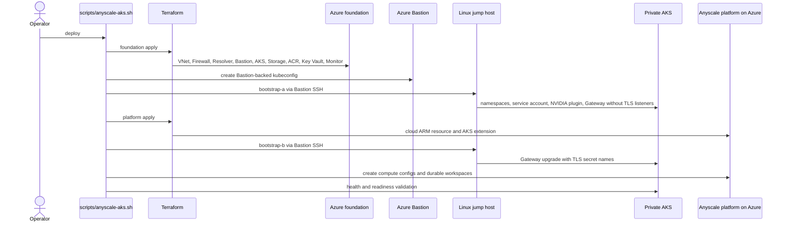
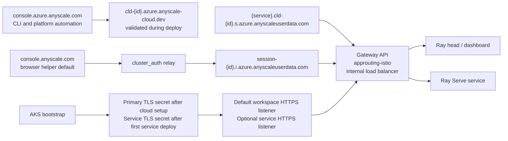
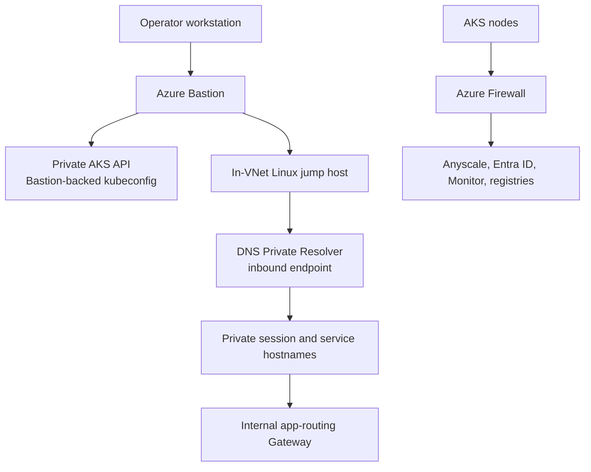

# Anyscale Private AKS Reference Architecture on Azure

> **Difficulty:** Advanced | **Roles:** Platform Engineer, Solution Architect | **Format:** Reference

This repository helps you build, prove, and tear down a private Anyscale on Azure environment on AKS. It creates the Azure network boundary, private AKS cluster, private storage and registry dependencies, Azure-native Anyscale platform resources, and the checks we use to prove the setup end to end.

The sample uses the following security and operating posture:

| Classification | Choice | Operational note |
| --- | --- | --- |
| Required | Private AKS API, Azure CNI, Azure network policy, OIDC, Workload Identity, and Entra-backed Kubernetes RBAC | The guided lab depends on this cluster and identity model. |
| Required | Private Gateway API through AKS app-routing Istio | Workspace and service traffic has no public workload ingress. |
| Required | Private ADLS Gen2, ACR, and Key Vault endpoints | AKS pulls from ACR through managed identity and `AcrPull`, not registry passwords. |
| Required | Azure Firewall default routes, explicit egress allow-lists, and DNS proxy | Applies to AKS and jump-host subnets. |
| Required | Azure Bastion and a Linux jump host with no public IPs | Terraform remains on the workstation; Modules 2-5 use the Linux jump host for private operations. |
| Default-on | Disabled AKS local accounts, Defender for Containers, Azure Policy, and Key Vault Secrets Provider | Configurable, but changing these controls alters the validated posture. |
| Default-on | AKS patch upgrades and node OS `SecurityPatch` upgrades | Review the channels before adapting the sample to a managed estate. |
| Default-on | Container Insights, Terraform-managed diagnostics, and AMPLS private ingestion | Public Log Analytics queries remain enabled. |
| Default-on, optional module | AKS Image Integrity with Ratify and Azure Policy audit | Module 5 is audit-only and does not block unsigned images. |
| Optional, default-off | Windows browser jump host | Provides in-VNet browser access to private Anyscale URLs. |
| Optional, default-off | Anyscale control-plane Private Link | Requires an Anyscale service alias and manual cross-tenant endpoint approval. |
| Optional, default-off | Key Vault purge protection | Enable for durable environments and accept delayed deletion. |

The [deployment profiles and optional features](#deployment-profiles-and-optional-features)
table lists the controlling inputs and operational consequences.

## Learning path

New here? Follow the hands-on lab from the workstation and trusted in-VNet Linux
jump host:

| Module | Outcome | Required |
| --- | --- | --- |
| [1. Foundation](docs/modules/module-1-foundation.md) | Build the network boundary, Firewall, Bastion, Linux jump host, and optional Windows browser jump host. | Yes |
| [2. Jump hosts](docs/modules/module-2-jump-hosts.md) | Bootstrap and verify the Linux jump-host toolchain and managed identity. | Yes |
| [3. Lab workload](docs/modules/module-3-lab-workload.md) | Deploy private AKS and the Anyscale platform, then run workload proofs. | Yes |
| [4. Custom images](docs/modules/module-4-custom-image.md) | Prove the standard-image failure, build and push the custom image, sign it, attach its SBOM, and prove the dependency. | Optional; required for Module 5 |
| [5. Image integrity](docs/modules/module-5-image-integrity.md) | Apply Ratify and compare signed and unsigned images in Azure Policy audit mode. | Optional |

Start at [docs/modules/intro.md](docs/modules/intro.md). The lab ends with
[Clean Up](docs/modules/cleanup.md) as its final step. [Browser Access](docs/modules/browser-access.md) is a cross-cutting lesson you can use
from any module.

Run any module step by step, or automate deployment, verification, custom-image
build/proof, workload proofs, and teardown:

```bash
./scripts/anyscale-aks.sh e2e --mode jump-host --custom-image --teardown
```

That shortcut excludes image signing and Module 5. For the full guided path,
omit `--teardown`, complete the remaining Module 4 and Module 5 steps, then use
the documented cleanup procedure.

## Contents

- [Learning path](#learning-path)
- [Reference scope](#reference-scope)
- [Architecture](#architecture)
- [What this sample deploys](#what-this-sample-deploys)
- [Design principles](#design-principles)
- [Hostnames and trust boundaries](#hostnames-and-trust-boundaries)
- [Repository layout](#repository-layout)
- [Prerequisites](#prerequisites)
- [Quickstart](#quickstart)
- [Environment configuration](#environment-configuration)
- [Deployment workflow](#deployment-workflow)
- [Validation and workload proofs](#validation-and-workload-proofs)
- [Private access options](#private-access-options)
- [Gateway API, app-routing Istio, and TLS lifecycle](#gateway-api-app-routing-istio-and-tls-lifecycle)
- [Day-2 operations](#day-2-operations)
- [Teardown](#teardown)
- [Deleting the Anyscale cloud resource safely](#deleting-the-anyscale-cloud-resource-safely)
- [Validated baseline and caveats](#validated-baseline-and-caveats)
- [Related docs](#related-docs)

## Reference scope

This repository focuses on the AKS workload landing zone and the Anyscale on Azure integration points inside that landing zone. It assumes the target subscription and tenant already have the governance, policy, identity, and connectivity requirements your organization needs outside this sample.

## Architecture

The overview shows the full validated lifecycle: the private Azure foundation, private AKS data plane, Anyscale on Azure control-plane integration, workload proof path, and the drain-before-delete cleanup path.


The overview is intentionally high level. Editable draw.io sources and rendered
PNGs provide the detailed views:

| View | Editable source | Rendered image |
| --- | --- | --- |
| Architecture overview | [01-architecture-overview.drawio](docs/diagrams/01-architecture-overview.drawio) | [PNG](docs/diagrams/01-architecture-overview.drawio.png) |
| Deployment sequence | [02-deployment-sequence.drawio](docs/diagrams/02-deployment-sequence.drawio) | [PNG](docs/diagrams/02-deployment-sequence.drawio.png) |
| Private data plane and TLS | [03-private-data-plane.drawio](docs/diagrams/03-private-data-plane.drawio) | [PNG](docs/diagrams/03-private-data-plane.drawio.png) |
| Operator access paths | [04-operator-access.drawio](docs/diagrams/04-operator-access.drawio) | [PNG](docs/diagrams/04-operator-access.drawio.png) |
| Guided module flow | [05-module-flow.drawio](docs/diagrams/05-module-flow.drawio) | [PNG](docs/diagrams/05-module-flow.drawio.png) |

The section-specific Mermaid views below summarize deployment sequencing,
private Gateway traffic, and operator access paths.

### Deep dive: deployment and control flow

This diagram shows why deployment uses two Terraform applies with two Kubernetes
bootstrap phases. The harness runs bootstrap phase A from the Linux jump host
before the platform apply, then runs phase B after the platform exists.



### Deep dive: private data plane, app-routing Istio, and TLS

This diagram shows the user traffic path, not public ingress. Browser and service hostnames stay on private `*.azure.anyscaleuserdata.com` names, route through the AKS-managed app-routing Istio Gateway, and terminate on Ray dashboard or Ray Serve targets inside AKS. Service TLS is created after a service exists; the optional service HTTPS listener is enabled only after that secret is present.



### Deep dive: Bastion and jump host access paths

This diagram shows the operator access path. Terraform and its state remain on
the operator workstation. Bastion provides access to the private AKS API and the
in-VNet Linux jump host, where `kubectl`, Helm, private validation, private
workspace or service access, and ACR build/push operations run. AKS node egress
stays controlled through Azure Firewall.



## What this sample deploys

| Layer | Components | Why it's here |
| --- | --- | --- |
| Networking | Private VNet, Azure Bastion, DNS Private Resolver, Azure Firewall, and private endpoints. | Isolates the AKS data plane and forces controlled, allow-listed egress. |
| AKS | Private AKS cluster with system, CPU, and GPU pools, OIDC issuer, Workload Identity, managed Gateway API installation, and app-routing Istio via `approuting-istio`. The cluster defaults to Entra-backed admin access with local accounts disabled, Microsoft Defender for Containers enabled, and the Key Vault Secrets Provider add-on enabled. | Runs Ray workloads with no public API server and a private Layer 7 entry point while keeping the control plane aligned with enterprise hardening defaults. |
| Cluster bootstrap | Namespaces, operator service-account adoption metadata, workload identity wiring, the Anyscale Gateway chart, and the NVIDIA device plugin. | Prepares the cluster for the Anyscale operator and GPU scheduling. |
| Private dependencies | ADLS Gen2, Premium ACR, and Key Vault with private endpoints, plus Azure RBAC wiring for the operator identity. | Keeps data, images, and the Module 4 signing certificate private-only and reachable from inside the VNet. |
| Anyscale platform | Azure-native Anyscale cloud ARM resource, AKS extension, built-in Anyscale Platform role assignments, `aks-cpu` and `aks-gpu` compute configs, and durable `aks-cpu-workspace` and `aks-gpu-workspace` workspaces. | Registers the Anyscale cloud on Azure and provisions reproducible workspaces. |
| Observability | Log Analytics, AMPLS, Container Insights, and Terraform-managed Azure diagnostics. | Provides private-link monitoring without public ingestion endpoints. |
| Validation | Static Terraform checks, live infrastructure validation, and deterministic CPU, GPU, build, train, and serve proofs. | Lets every architecture claim be re-tested with a known-good marker. |

## Design principles

- Treat this repository as a reference implementation for a private AKS data plane, not as a public ingress sample.
- Keep Terraform and its state on the operator workstation; use Bastion-backed
   access for the private AKS API and Linux jump host.
- Use the in-VNet Linux jump host for routed private endpoint access, including custom-image push to private ACR and private workspace or service hostnames.
- Keep Blob, DFS, and ACR private-only and test both in-cluster and submitter-machine access paths.
- Force node egress through Azure Firewall and maintain the documented allow-lists for Anyscale, Microsoft identity, Monitor, registries, and NVIDIA endpoints.
- Use AKS-managed Gateway API and app-routing Istio as the private Layer 7 entry point for browser, dashboard, and service traffic.
- Default to Entra-backed AKS administration; local cluster admin accounts are disabled unless you explicitly opt out for a temporary break-glass scenario.
- Keep deterministic validation in the repo so each architecture claim can be tested again later.

## Hostnames and trust boundaries

| Surface | Default or pattern | Purpose |
| --- | --- | --- |
| `ANYSCALE_HOST` | `https://console.azure.anyscale.com` | CLI, AKS extension, teardown helpers, and platform automation. |
| `ANYSCALE_BROWSER_AUTH_HOST` | `https://console.anyscale.com` | Browser helper flows and `cluster_auth` relay entrypoint. |
| Anyscale cloud endpoint | `cld-{id}.azure.anyscale-cloud.dev` | Cloud endpoint validated during workspace registration before any CoreDNS aliasing logic is considered. |
| Workspace session host | `session-{id}.i.azure.anyscaleuserdata.com` | Private workspace and Ray dashboard browser path. |
| Service host | `{service}.cld-{id}.s.azure.anyscaleuserdata.com` | Private Anyscale service path. |

`scripts/anyscale-aks.sh deploy` validates the Azure cloud endpoint certificate before workspace registration. The browser helper default is `console.anyscale.com`, while CLI and platform automation use `console.azure.anyscale.com`.

### Optional: Anyscale control plane Private Link

An optional, default-off capability (`enable_privatelink`) moves control-plane traffic onto a private endpoint inside the VNet instead of egressing through Azure Firewall. When enabled, Terraform creates a cross-tenant private endpoint to the Anyscale Private Link Service, a private DNS zone, a VNet link, and A records, so in-VNet hosts resolve the cloud-specific hostname `cld-{id}.azure.anyscale-cloud.dev` to a private IP.

Two facts to keep straight:

- The **public** browser/OAuth console `console.azure.anyscale.com` stays on public DNS. It is a different domain and must **not** be expected to resolve to the private endpoint IP. Local Anyscale CLI, OAuth login, and teardown keep using it; only the in-cluster operator is pointed at the private `cld-{id}` host (via `anyscale_platform.operator_control_plane_url`).
- The connection is **cross-tenant and manual**: the endpoint stays `Pending` until Anyscale approves it, so a clean `terraform apply` is not evidence the path works. DNS resolves before approval; approval and a TLS probe are separate checks. Verify DNS from the Windows browser jump host with `./scripts/anyscale-aks.sh privatelink-proof --hostname cld-{id}.azure.anyscale-cloud.dev`.

## Repository layout

| Path | Purpose |
| --- | --- |
| `infra/terraform/` | Terraform root for the lab RG, network, Bastion, jump hosts, firewall, DNS, AKS, Anyscale platform resources, outputs, and Terraform tests. |
| `scripts/anyscale-aks.sh` | Main entry point for deploy, verify, workload proofs, status, doctor, browser helpers, and teardown. |
| `scripts/setup.sh` | Shared implementation for deployment, validation, proof, and teardown commands. |
| `scripts/modules/` | Module-oriented wrappers for the user journey: foundation, jump hosts, lab workload, custom images, and image integrity. |
| `workloads/proofs/` | Deterministic CPU, GPU, build, train, serve, and custom-image dependency proof workloads. |
| `scripts/utility/` | Non-core utility implementations for local self-tests and workspace diagnostics. |
| `workloads/custom-image/` | Dockerfile and requirements for the custom Ray image built and pushed to the private ACR. |
| `workloads/image-integrity/` | Ratify trust policy and verifier manifests for the image-integrity audit demo. |
| `docs/modules/` | Hands-on module instructions for the guided end-to-end flow. |
| `docs/` | Architecture diagrams, module runbooks, configuration reference, maintainer workflows, and proof markers. |

## Prerequisites

Before starting, make sure you have Azure access, a local operator workstation,
and Anyscale access.

- The central command, `./scripts/anyscale-aks.sh`, checks command-specific dependencies before deploy, proof, teardown, and full e2e runs. Missing tools fail early with install guidance.
- The Anyscale CLI must be installed into the repo virtual environment at `.venv/bin/anyscale`.
- The Azure CLI `aks-preview` and `bastion` extensions are installed automatically when needed. Install the `ssh` extension before using Module 1 Bastion SSH: `az extension add -n ssh`.
- Azure permissions must allow networking, Firewall, Bastion, AKS, Private Link, storage, ACR, Log Analytics, managed identities, RBAC assignments, and the Anyscale marketplace resources.
- GPU quota for `Standard_NC16as_T4_v3` in the target region.
- Sign in to the Anyscale CLI with `ANYSCALE_HOST=https://console.azure.anyscale.com .venv/bin/anyscale login`, or set `ANYSCALE_CLI_TOKEN` for non-interactive automation.

| Required tool | Minimum version |
| --- | --- |
| Git | Supported vendor version |
| Azure CLI | `2.86.0` |
| Terraform | `1.9.0` |
| Python | `3.9` |
| `kubectl`, `kubelogin`, Helm, `jq`, `rsync`, `uv`, `curl`, `lsof` | Checked by `doctor` |

Run a readiness report with `./scripts/anyscale-aks.sh doctor`. The full dependency table and optional maintainer tools are in [docs/maintainer-workflows.md](docs/maintainer-workflows.md).

Install the repo-local Anyscale CLI before deploy:

```bash
uv venv .venv
UV_CACHE_DIR="$PWD/.cache/uv-cache" uv pip install --python .venv/bin/python anyscale
```

## Quickstart

New users should follow the module path in [docs/modules/intro.md](docs/modules/intro.md):
Module 1 builds the foundation, Module 2 prepares the jump host, Module 3
deploys and proves the lab workload, Module 4 demonstrates the custom-image
requirement, signs the image, and attaches its SBOM. Module 5 proves
image-integrity audit behavior. The commands below run the required deployment
and proof path.

```bash
cp .env-template .env
source .env
az login --tenant "$TF_VAR_azure_tenant_id"

uv venv .venv
source .venv/bin/activate
UV_CACHE_DIR="$PWD/.cache/uv-cache" uv pip install --python .venv/bin/python anyscale

./scripts/anyscale-aks.sh deploy
./scripts/anyscale-aks.sh verify --full
./scripts/anyscale-aks.sh proof all
```

`scripts/anyscale-aks.sh` exports deployment variables from `.env` as
`TF_VAR_*`, uses cached Anyscale CLI OAuth or `ANYSCALE_CLI_TOKEN` when
provided, and manages the Bastion-backed kubeconfig for private AKS bootstrap.
No tfvars file is written.

## Environment configuration

Start from a fresh clone and copy `.env-template` to `.env`.

```bash
cp .env-template .env
```

`.env` is the single source of deployment inputs and must define **every**
Terraform root variable. `infra/terraform/variables.tf` carries no root
`default` values, so a missing key fails fast at render time instead of falling
back to a hidden default. `.env-template` lists every key with a safe starting
value; when you pull new keys, copy them into `.env`. The quality gate compares
`.env-template` and `.env` by variable name only and never reads their values.

The most important inputs are:

| Setting group | What to set |
| --- | --- |
| `ARM_*` | Azure authentication and subscription context. The default path is `ARM_USE_CLI=true`. |
| `TF_VAR_project`, `TF_VAR_environment`, `TF_VAR_azure_location`, `TF_VAR_region_short` | Naming and region selection. |
| `TF_VAR_vnet_address_space`, `TF_VAR_subnet_cidrs` | Network ranges for the sample VNet and subnets. |
| Anyscale CLI auth | Run `ANYSCALE_HOST=https://console.azure.anyscale.com .venv/bin/anyscale login` for local OAuth, or set `ANYSCALE_CLI_TOKEN` for non-interactive automation. |
| `ANYSCALE_HOST` | Defaults to `https://console.azure.anyscale.com` for CLI and automation auth. |
| `ANYSCALE_BROWSER_AUTH_HOST` | Defaults to `https://console.anyscale.com` for browser helper flows and `cluster_auth`. |
| `TF_VAR_anyscale_fqdns`, `TF_VAR_azure_identity_fqdns`, `TF_VAR_azure_monitor_fqdns`, `TF_VAR_container_registry_fqdns` | Firewall allow-lists for Anyscale, identity, observability, and registries. |
| `TF_VAR_anyscale_platform_default_admin_assignment` | Defaults to assigning the current Terraform principal the built-in Anyscale Platform Administrator role at subscription scope for org-owner-style console access. |
| `TF_VAR_anyscale_platform_role_assignments` | Optional Azure RBAC assignments for additional Anyscale Platform Administrator, Contributor, or Reader principals at subscription, resource group, cloud, or custom scope. |
| `TF_VAR_gpu_pool_configs` | GPU pool sizing. The default keeps one T4 node warm. |

### Naming and configuration conventions

Terraform resource names are generated in `local.names`. Root input names use
`enable_*` for optional resource creation, `*_enabled` for service behavior,
and `assign_*` for RBAC grants. Platform RBAC uses
`anyscale_platform_role_assignments`; teardown behavior uses
`anyscale_platform.teardown`.

### Deployment profiles and optional features

The standard full-lab profile is the Quickstart configuration: leave the feature
defaults in `.env-template`, set the environment-specific values in `.env`, and
run `./scripts/anyscale-aks.sh deploy`. The network boundary, Firewall, Bastion,
Linux jump host, DNS resolver and zones, storage, ACR, Key Vault, Log Analytics,
and AKS cluster are baseline resources without deployment toggles.

| Classification | Feature and input | Template default | Deployment guidance |
| --- | --- | --- | --- |
| Required for the full lab | Anyscale platform: `TF_VAR_anyscale_platform` | `{}` (enabled) | Keep enabled for `deploy`; the platform, extension, compute configs, and workspaces are the purpose of the full-lab workflow. |
| Optional, default-off | Windows browser jump host: `TF_VAR_enable_browser_host` | `false` | Set `true` before `deploy`, or use Module 1 with `--enable-browser-host`. Keep `TF_VAR_azure_portal_fqdns` populated so the private browser subnet can load Azure portal and sign-in endpoints. |
| Optional, default-off | Anyscale control-plane Private Link: `TF_VAR_enable_privatelink` | `false` | Use a two-pass deploy: create the endpoint with the operator still using the public URL, obtain Anyscale approval, set the cloud-specific private operator URL, rerun `deploy`, then run `privatelink-proof`. |
| Optional, default-on | AKS Image Integrity: `TF_VAR_enable_image_integrity` | `true` | Set `false` when Module 5 is out of scope or the deploying principal lacks policy-assignment permission. Keep `TF_VAR_azure_policy_enabled=true` when Image Integrity is enabled. |
| Optional, default-on | AMPLS: `TF_VAR_ampls_enabled` | `true` | Keep enabled for private Monitor ingestion. If disabled, set `TF_VAR_log_analytics_internet_ingestion_enabled=true` when logs must continue through the public endpoint. |
| Optional, default-on | Container Insights and diagnostics: `TF_VAR_container_insights_v2_enabled`, `TF_VAR_terraform_managed_diagnostic_settings_enabled` | `true` | Disable only when another platform owns collection or Azure Policy owns diagnostic settings. Set the storage diagnostic input consistently. |
| Optional, default-on | AKS hardening: `TF_VAR_azure_policy_enabled`, `TF_VAR_defender_enabled`, `TF_VAR_local_account_disabled`, `TF_VAR_key_vault_secrets_provider_enabled` | `true` | Keep the defaults for the reference posture. Any exception should be explicit and reviewed. |
| Optional, default-on | ACR zone redundancy: `TF_VAR_acr_zone_redundancy_enabled` | `true` | Set `false` only when the selected region does not support zones or for a deliberate lower-cost test environment. |
| Optional access grant | Jump-host subscription Contributor: `TF_VAR_assign_jump_host_subscription_contributor` | `true` | Set `false` only after replacing it with the scoped roles required by the jump-host deployment and proof workflow. |
| Optional hardening, default-off | Key Vault purge protection: `TF_VAR_key_vault_purge_protection_enabled` | `false` | Set `true` for durable environments; purge-protected vaults cannot be immediately removed during lab teardown. |
| Post-deploy | Service Gateway HTTPS: `TF_VAR_bootstrap_k8s.gateway_service_https_enabled` | `false` | Enable only after an Anyscale service creates the service TLS secret, then rerun `deploy` to reconcile the listener. |

For a CPU-only deployment, set the following in `.env`; the harness skips the GPU
workspace and GPU-only proofs:

```bash
# In .env:
TF_VAR_gpu_pool_configs='{}'

# Then deploy and run the supported proofs:
./scripts/anyscale-aks.sh deploy
./scripts/anyscale-aks.sh proof all
```

For foundation-only work, do not disable the platform and run the full `deploy`
command because its workspace stage requires a registered Anyscale cloud. Use
the Module 1 boundary instead:

```bash
./scripts/anyscale-aks.sh module 1 sizes
./scripts/anyscale-aks.sh module 1 plan
./scripts/anyscale-aks.sh module 1 apply --yes
```

`TF_VAR_anyscale_jump_host_fqdns='[]'` intentionally inherits
`TF_VAR_anyscale_fqdns`. Set a separate list only when the Linux jump-host CLI
needs public console, API, or browser-auth destinations that AKS nodes should not
receive.

## Deployment workflow

Use the orchestrator instead of raw Terraform commands and one-off shell steps. It builds the private Azure foundation, opens the Bastion-backed AKS path, installs the Anyscale platform pieces, and creates or reconciles the durable CPU and GPU workspaces.

```bash
./scripts/anyscale-aks.sh deploy
```

The deploy runs nine stages and finishes with a health summary (`<n>s` is the measured
stage duration):

```output
[setup] [9/9] health started
[setup] Azure AKS cluster aks-<project>-<env>-<region> is Succeeded/Running.
[setup] Anyscale AKS extension anyscale-operator provisioningState=Succeeded.
[setup] Anyscale cloud resource provisioningState=Succeeded.
[setup] Anyscale operator, app-routing Istio control plane, and Anyscale Gateway are Available.
[setup] CPU workspace aks-cpu-workspace API status=RUNNING.
[setup] GPU workspace aks-gpu-workspace API status=RUNNING.
[setup] [9/9] health ok (<n>s)
[setup] Deployment complete. Run ./scripts/anyscale-aks.sh verify --full, then ./scripts/anyscale-aks.sh proof all.
```

For a clean rebuild from scratch:

```bash
./scripts/anyscale-aks.sh deploy --from-scratch --yes
```

Every run writes local logs under `.cache/aks-anyscale-sample-harness/runs/<timestamp>-<command>/`, including `summary.md`, `stages.tsv`, and per-stage logs. The stage-by-stage breakdown is in [docs/maintainer-workflows.md](docs/maintainer-workflows.md).

## Validation and workload proofs

### Validation modes

```bash
./scripts/anyscale-aks.sh verify --static
./scripts/anyscale-aks.sh verify --live --skip-observability
./scripts/anyscale-aks.sh verify --full
```

| Command | What it checks |
| --- | --- |
| `verify --static` | `terraform fmt -check` and `terraform validate` with inputs exported from `.env`. Run the plan-time Terraform contracts separately with `./scripts/anyscale-aks.sh self-test terraform`. |
| `verify --live [--skip-observability]` | Azure resource state, Bastion-backed `kubectl`, operator rollout, workspace readiness, private DNS, Firewall-routed egress, Workload Identity storage access, submitter-machine private storage access, app-routing Gateway readiness and private reachability, Gateway TLS lifecycle, GPU scheduling, and observability when enabled. |
| `verify --full` | Runs both static and live validation. |

### Quality gate and Git hooks

Before committing, run the canonical local quality gate:

```bash
./scripts/anyscale-aks.sh self-test quality   # or: ./scripts/quality-gate.sh
```

It enforces the env-name contract, the no-root-defaults rule, tracked-artifact
hygiene, `terraform fmt`/`validate`/TFLint, shell `bash -n`/ShellCheck/`shfmt`,
Python `py_compile`/Ruff/pyright, markdown/YAML/Dockerfile lint, and Trivy
config/vulnerability/secret scans (cache under `.cache/trivy`). Missing required
tools are reported with install guidance.

Install the staged commit and push hooks once per checkout:

```bash
pre-commit install --install-hooks --hook-type pre-commit --hook-type pre-push
```

Commit hooks run fast, non-mutating checks only on selected files, including a
Trivy config and secret scan. Push hooks run the full canonical gate,
all Trivy scanners, the agent validator, and the 18 Terraform contract tests.
Run either stage on demand:

```bash
pre-commit run --all-files
pre-commit run --all-files --hook-stage pre-push
pre-commit run --all-files --hook-stage manual
```

### Workload proofs

`deploy` registers the durable compute configs and workspaces:

- `aks-cpu`
- `aks-gpu`
- `aks-cpu-workspace`
- `aks-gpu-workspace`

Run the deterministic proofs with:

```bash
./scripts/anyscale-aks.sh proof cpu
./scripts/anyscale-aks.sh proof gpu
./scripts/anyscale-aks.sh proof pipeline
./scripts/anyscale-aks.sh proof all
```

Each proof prints a deterministic JSON payload followed by its success marker:

```output
{"marker": "CPU_RAY_PROOF_OK", "row_count": 16, "square_sum": 1240}
CPU_RAY_PROOF_OK
{"cube_sum": 784, "gpu_capacity": 1.0, "marker": "GPU_RAY_PROOF_OK", "row_count": 8}
GPU_RAY_PROOF_OK
CPU_BUILD_JOB_PROOF_OK
GPU_TRAIN_JOB_PROOF_OK
GPU_SERVE_SERVICE_PROOF_OK
```

| Command | Scope | Expected success markers |
| --- | --- | --- |
| `proof cpu` | Durable CPU workspace proof | `CPU_RAY_PROOF_OK` |
| `proof gpu` | Durable GPU workspace proof | `GPU_RAY_PROOF_OK` |
| `proof pipeline` | CPU build job, GPU train job, and GPU serve proof | `CPU_BUILD_JOB_PROOF_OK`, `GPU_TRAIN_JOB_PROOF_OK`, `GPU_SERVE_SERVICE_PROOF_OK` |
| `proof all` | Both durable workspace proofs plus the pipeline | All of the above |

The proof flow pushes the scripts in `workloads/proofs/`, runs them through the Anyscale CLI or the Kubernetes-backed fallbacks built into the harness, checks the expected markers, and writes diagnostics under `.cache/aks-anyscale-sample-harness/runs/<timestamp>-workload-*/`.

In the validated private AKS path, Anyscale job logs and service endpoint probes may need to run from inside the private workspace network. The harness detects successful jobs whose local submit stream missed a marker and retrieves logs from the workspace head pod; service probes retry from a service head pod inside AKS when direct workstation access to the private `*.s.azure.anyscaleuserdata.com` hostname times out. A complete workload proof is successful when all expected CPU, GPU, build, train, and serve markers are emitted.

### Full run results

The full e2e command writes a short local report to `RESULTS.md` at the repo root and overwrites any existing report:

```bash
./scripts/anyscale-aks.sh e2e --teardown
```

For the custom-image scenario, `e2e --custom-image` deploys and verifies through
Bastion-backed AKS access, then builds and pushes the custom image from the
in-VNet Linux jump host where the private ACR endpoints resolve. It runs the
expected failure, preflight, build/push, workspace application, dependency
proof, and, when Syft and ORAS are available, SBOM steps. It does not sign or
verify the image and does not run Module 5. Run `module 4 sign` and `module 4
verify` before following the Module 5 Image Integrity procedure.

The report is intentionally not tracked by Git. It records whether build-up, full verification, workload proofs, and teardown passed for that invocation.

## Private access options

### Bastion-backed administration

Bastion is the primary access path for the private cluster.

- `scripts/anyscale-aks.sh` creates and reuses Bastion-backed private AKS access
    for `kubectl`, Helm, live validation, and workload proof commands. Terraform
    and its state remain on the workstation.
- Use Bastion first for cluster administration, health checks, and post-deploy troubleshooting.
- Keep Bastion available until Kubernetes resources managed through the Bastion-backed kubeconfig are torn down.

### Browser helper flows

If you want local browser testing without changing your system network, the repo also includes isolated helper flows:

```bash
./scripts/anyscale-aks.sh browser open --session-id ses_xxx
./scripts/anyscale-aks.sh head open --session-id ses_xxx
```

- `workspace-browser-open` starts or reuses the Bastion tunnel, discovers the private Gateway service, port-forwards ports 80 and 443 locally, launches a temporary Firefox profile, and opens the `cluster_auth` flow for the target private session host.
- `workspace-head-open` starts the direct Ray Dashboard head-service port-forward plus the Gateway tunnel and launches a temporary Firefox profile directly against the local dashboard fallback.

Stop them with:

```bash
./scripts/anyscale-aks.sh browser stop
./scripts/anyscale-aks.sh head stop
```

## Gateway API, app-routing Istio, and TLS lifecycle

This sample treats AKS-managed Gateway API and app-routing Istio as the target private Layer 7 path.

- `scripts/anyscale-aks.sh` requires Azure CLI `2.86.0` or newer, then verifies the app-routing Gateway API prerequisites before Terraform enables `properties.ingressProfile.gatewayAPI.installation = "Standard"`.
- `scripts/bootstrap-k8s.sh` deploys the Anyscale Gateway chart from the Linux
    jump host with `gatewayClassName: approuting-istio`, internal load balancer
    annotations, and a stable private load balancer IP.
- The Anyscale AKS extension uses `networking.gateway.*` settings and emits Gateway API `HTTPRoute` resources.
- The primary TLS secret `anyscale-<cloud-deployment-id-with-hyphens>-certificate` is expected after the Azure-native cloud and operator setup completes.
- The service TLS secret `anyscale-svc-<cloud-deployment-id-with-hyphens>-certificate` appears after an Anyscale service is deployed; enable `cluster_bootstrap.gateway_service_https_enabled` after that secret exists to add the service HTTPS listener.
- The Gateway has an HTTPS listener for `*.i.azure.anyscaleuserdata.com` by default and can add the `*.s.azure.anyscaleuserdata.com` service listener, matching the Anyscale on Azure Gateway API guidance while using AKS app-routing Istio as the managed Gateway implementation.
- The default Gateway listeners are `http` and `https`. The optional `https-service` listener should be enabled only after the service TLS secret exists.
- `verify --live` reports Gateway reachability, listener conditions, primary certificate state, and service-certificate pending or present state.

## Day-2 operations

For normal operation, use the same proof-first loop from the quickstart: `deploy`, `verify --full`, `proof all`, then `teardown` when you are done. Useful status commands are:

```bash
./scripts/anyscale-aks.sh status
./scripts/anyscale-aks.sh doctor
```

Maintainer workflows for dependency details, custom Ray images, run artifacts,
optional AKS tooling, diagram export, and idempotency self-tests are in
[docs/maintainer-workflows.md](docs/maintainer-workflows.md). For image signing,
see [Module 4: Custom images](docs/modules/module-4-custom-image.md). For the
Ratify and Azure Policy audit, see
[Module 5: Image integrity](docs/modules/module-5-image-integrity.md).

## Teardown

Use the normal path when you want Terraform-backed cleanup:

```bash
./scripts/anyscale-aks.sh teardown
```

That path drains the Anyscale cloud first, stops Bastion if needed, runs `terraform destroy`, and clears the cached cloud deployment ID from `.env`.

For the module path, use [docs/modules/cleanup.md](docs/modules/cleanup.md): run
`./scripts/anyscale-aks.sh module 3 teardown` to tear down the whole lab. That
command runs the full single-root `terraform destroy`, so there is no separate
foundation layer left to remove afterward.

Use the stronger reset path when you need Azure CLI to delete the resource group directly and clear local state:

```bash
./scripts/anyscale-aks.sh teardown --force --yes
```

That flow first drains the Anyscale cloud, then deletes the shared lab resource
group, waits for the delete to finish, and removes local Terraform state and
saved plans for the Terraform root. It keeps `.env` and `.terraform.lock.hcl`.

## Deleting the Anyscale Cloud Resource Safely

The Anyscale cloud ARM resource is not just another Azure object. It represents a live Anyscale cloud in the hosted Anyscale control plane, and that cloud can still have workspaces, jobs, services, and backing Ray sessions attached to it.

Before deleting the Anyscale cloud resource, the harness drains the Anyscale side first:

1. It maps the Azure cloud ARM resource name to the Anyscale cloud ID.
2. It lists the current cloud's services, jobs, and workspaces, including archived resources where the CLI supports it.
3. It asks Anyscale to terminate services in that cloud.
4. It asks Anyscale to terminate workspaces in that cloud.
5. If a workspace still has a backing Ray session or cluster ID, it also sends a direct cluster terminate request.
6. It waits until jobs, services, and workspaces reach terminal states before Azure deletion continues.
7. It deletes the nested Azure cloud resource child, `cloudResources/default`, before deleting the parent Anyscale cloud ARM resource.

This order provides two guarantees:

- It gives Anyscale a chance to shut down workspaces, services, jobs, and Ray sessions cleanly before Azure removes the infrastructure underneath them.
- It avoids Azure delete blockers where the parent Anyscale cloud resource cannot be removed while nested cloud resources still exist.

If the Anyscale cloud resource is already gone, the force teardown path skips the cloud drain and continues with Azure resource-group deletion. That makes recovery safe to rerun after a partial teardown.

## Validated baseline and caveats

The baseline targets Kubernetes `1.34.6` in `westus2`.

Known non-blocking caveats:

- The operator pod can still emit recurring `502 Bad Gateway` warnings from the `vector` sidecar telemetry sinks on `http://localhost:3100` and `http://localhost:3101/api/v1/push`.
- The custom GPU instance type requires both `'accelerator_type:T4': 1` and `accelerators: [T4]` for the current admission path.
- `anyscale job submit --working-dir` still uploads through the submitter machine first, so private Blob and DFS access from the submitter must be validated separately from in-cluster Workload Identity.
- Normal Terraform teardown can still fail late if the Kubernetes provider loses Bastion-backed API access while deleting Kubernetes resources. The force teardown path is the supported recovery path for that condition.

## Related docs

- `README.md` is the main operator guide.
- [docs/modules/intro.md](docs/modules/intro.md) is the hands-on lab landing page; the five module docs ([Module 1](docs/modules/module-1-foundation.md), [Module 2](docs/modules/module-2-jump-hosts.md), [Module 3](docs/modules/module-3-lab-workload.md), [Module 4](docs/modules/module-4-custom-image.md), [Module 5](docs/modules/module-5-image-integrity.md)) plus [Browser Access](docs/modules/browser-access.md) and [Clean Up](docs/modules/cleanup.md) are the recommended learning path.
- [docs/project-summary.md](docs/project-summary.md) is the maintainer-oriented summary of repository structure, architecture, operating contracts, and contribution rules.
- [docs/configuration-reference.md](docs/configuration-reference.md) defines current deployment inputs, invariants, optional features, and modification points.
- [docs/maintainer-workflows.md](docs/maintainer-workflows.md) defines maintainer setup, checks, deploy stages, artifacts, and optional tooling.
- [docs/proof-markers.md](docs/proof-markers.md) defines stable proof markers and evidence interpretation.
