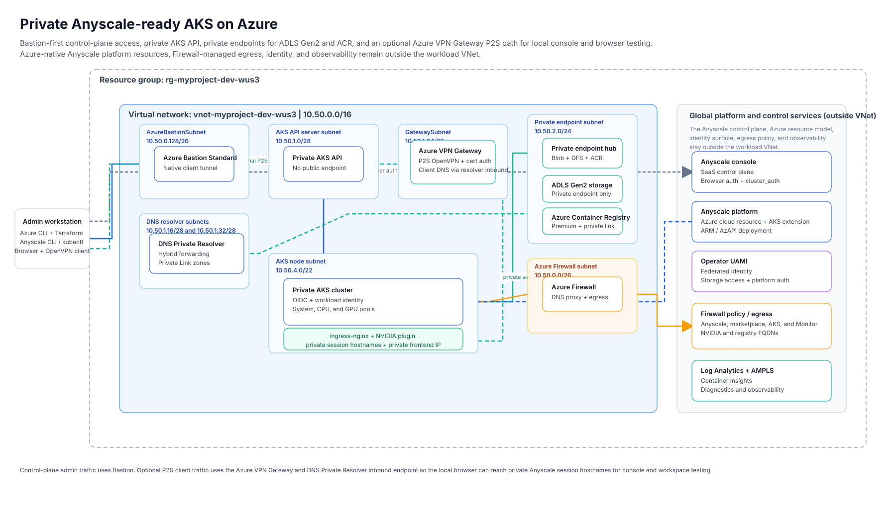

# Private AKS foundation for Anyscale on Azure

This sample deploys a private, Azure-native AKS landing zone for Anyscale. It builds the network, Azure Bastion access path, Azure Firewall egress controls, DNS Private Resolver, private AKS cluster, private storage and ACR, observability, the Anyscale operator identity, and the Azure-side Anyscale resources and workspace scaffolding needed to bring the platform up from a local workstation.

The Anyscale control plane remains SaaS-hosted at `https://console.azure.anyscale.com`. This repository manages the private AKS data plane, operator workflow, validation path, optional Point-to-Site (P2S) VPN access, and deterministic workload proofs.

## Architecture



The editable source is `docs/architecture.drawio`. Regenerate the checked-in preview with:

```bash
bash scripts/export-diagrams.sh
```

## What this sample deploys

| Layer | What it creates |
| --- | --- |
| Networking | A private VNet with Azure Bastion, private AKS API subnet, AKS node subnet, DNS Private Resolver, Azure Firewall, private endpoints, and an optional `GatewaySubnet` for P2S VPN. |
| AKS | A private AKS cluster with system, CPU, and GPU pools, OIDC issuer, Workload Identity, ingress-nginx, and the NVIDIA device plugin bootstrap. |
| Data plane dependencies | Private ADLS Gen2, private Premium ACR, managed identity and RBAC wiring for the Anyscale operator, and Azure Monitor / Log Analytics integration. |
| Anyscale platform | The Azure-native Anyscale cloud resource, AKS extension, `aks-cpu` and `aks-gpu` compute configs, and durable `aks-cpu-workspace` and `aks-gpu-workspace` workspaces. |
| Optional client access | An Azure VPN Gateway P2S path for routed local console and browser testing of private session endpoints. |

This sample is intentionally opinionated: AKS stays private, storage and ACR stay private-only, node egress is forced through Azure Firewall, Bastion stays the primary control-plane path, and the optional P2S path is for routed client access rather than day-1 cluster administration.

## Repository layout

| Path | Purpose |
| --- | --- |
| `infra/terraform/` | Azure infrastructure, Anyscale platform resources, outputs, and Terraform tests. |
| `scripts/setup.sh` | Main operator entry point for deploy, verify, workload proof, idempotency, and teardown. |
| `workloads/proofs/` | Deterministic CPU, GPU, build, train, and serve proof workloads. |
| `p2s-vpn-proof.sh` | Local helper for connecting to and proving the optional P2S VPN path. |
| `docs/` | Architecture source and checked-in preview assets. |

## Prerequisites

You need Azure access, a local operator workstation, and an Anyscale token before starting.

- **Local tools:** Git, Azure CLI, Terraform `>= 1.9.0`, `kubectl`, `kubelogin`, `helm`, `jq`, `rsync`, Python `3.9+`, and `uv`.
- **Private-cluster helpers:** the Azure CLI `aks-preview` and `bastion` extensions are installed automatically when needed; `openssl` is required if you use the auto-generated P2S lab certificates.
- **Optional local access tooling:** Firefox for the isolated browser helper flows, OpenVPN / Tunnelblick / OpenVPN Connect for P2S testing, and draw.io / diagrams.net CLI if you regenerate the SVG.
- **Azure permissions:** enough rights to create networking, Azure Firewall, Bastion, AKS, Private Link, storage, ACR, Log Analytics, managed identities, RBAC assignments, and the Anyscale marketplace resources.
- **Quota:** GPU quota for `Standard_NC16as_T4_v3` in the target region; the validated baseline keeps one T4 node warm.
- **Anyscale access:** `ANYSCALE_CLI_TOKEN` must be set before `deploy`, and the repo-local CLI is expected at `.venv/bin/anyscale`.

## Configure your environment

Start from a fresh clone and create a local `.env`.

```bash
cp .env-template .env
```

The most important inputs are:

| Setting group | What to set |
| --- | --- |
| `ARM_*` | Azure authentication and subscription context. The default path is `ARM_USE_CLI=true`. |
| `TF_VAR_project`, `TF_VAR_environment`, `TF_VAR_azure_location`, `TF_VAR_region_short` | Naming and region selection. |
| `TF_VAR_vnet_address_space`, `TF_VAR_subnet_cidrs` | Network ranges for the sample VNet and subnets. |
| `ANYSCALE_CLI_TOKEN` | Required before `./scripts/setup.sh deploy`. |
| `ANYSCALE_HOST` | Defaults to `https://console.azure.anyscale.com`. |
| `TF_VAR_anyscale_fqdns`, `TF_VAR_azure_identity_fqdns`, `TF_VAR_azure_monitor_fqdns`, `TF_VAR_container_registry_fqdns` | Firewall allow-lists for Anyscale, Azure auth, observability, and registries. |
| `TF_VAR_gpu_pool_configs` | GPU pool sizing. The template keeps one T4 node warm by default. |
| `TF_VAR_enable_p2s_vpn` and related `TF_VAR_p2s_*` values | Optional P2S VPN path for routed local browser testing. |

`scripts/setup.sh` renders `infra/terraform/terraform.auto.tfvars.json` from `.env` automatically and mirrors `ANYSCALE_CLI_TOKEN` into Terraform protected settings, so you usually do not need to set `TF_VAR_anyscale_cli_token` separately.

## Phase 1: Prepare the workstation

Authenticate Azure CLI, then create the repo-local Anyscale CLI environment.

```bash
source .env
az login --tenant "$TF_VAR_azure_tenant_id"

uv venv .venv
source .venv/bin/activate
UV_CACHE_DIR="$PWD/.cache/uv-cache" uv pip install --python .venv/bin/python anyscale
```

You can use `.venv/bin/anyscale` directly for ad hoc inspection, but the automated flow reads `ANYSCALE_CLI_TOKEN` from `.env` and fails fast when it is missing.

## Phase 2: Build up the environment

Use the orchestrator rather than raw Terraform and ad hoc shell commands.

```bash
./scripts/setup.sh deploy
```

For a clean rebuild from scratch:

```bash
./scripts/setup.sh deploy --from-scratch --yes
```

`deploy` is intentionally phase-based:

| `deploy` stage | What it does |
| --- | --- |
| `prepare` | Loads `.env`, checks required CLIs, validates Azure login, and selects the target subscription. |
| `reset-or-state` | Reconciles or resets local state. `--from-scratch --yes` deletes the target resource group and purges local Terraform state first. |
| `terraform-init-validate` | Runs `terraform init`, `terraform fmt -check`, `terraform validate`, and the plan-time Terraform tests. |
| `foundation` | Applies phase 1 Azure resources: network, Firewall, Bastion, private AKS, storage, ACR, identity, and observability. |
| `platform` | Opens Bastion-backed AKS access, applies the Terraform-managed bootstrap layer, and deploys the Azure-native Anyscale cloud and AKS extension. |
| `vpn-profile` | When P2S is enabled, generates the Azure VPN client package plus local-ready artifacts. |
| `workspaces` | Registers or reconciles `aks-cpu` / `aks-gpu` and creates or updates the durable workspaces. |
| `health` | Runs the live post-deploy health checks. |

Every run writes logs under `.cache/aks-anyscale-sample-harness/runs/<timestamp>-<command>/`, including `summary.md`, `stages.tsv`, and per-stage logs.

## Phase 3: Validate the deployment

The repository supports three validation modes:

```bash
./scripts/setup.sh verify --static
./scripts/setup.sh verify --live --skip-observability
./scripts/setup.sh verify --full
```

| Command | What it checks |
| --- | --- |
| `verify --static` | `terraform fmt -check`, `terraform validate`, and the plan-time Terraform contracts. |
| `verify --live [--skip-observability]` | Azure resource state, Bastion-backed `kubectl` access, operator rollout, workspace readiness, private DNS, firewall-routed egress, Workload Identity storage access, internal ingress reachability, GPU scheduling, and observability when enabled. |
| `verify --full` | Runs both static and live validation. |

Useful day-2 commands:

```bash
./scripts/setup.sh status
./scripts/setup.sh health
terraform -chdir=infra/terraform output
```

For a deeper Terraform-only resource test:

```bash
terraform -chdir=infra/terraform test -filter=tests/apply.tftest.hcl -verbose
```

## Phase 4: Optional P2S VPN and local console testing

The optional P2S path exists for routed client access to private session endpoints from your workstation. Bastion remains the primary path for `kubectl`, Terraform, and Helm.

Enable it in `.env` before deployment:

```bash
TF_VAR_enable_p2s_vpn="true"
# TF_VAR_vpn_gateway_sku="VpnGw1AZ"
# TF_VAR_p2s_client_address_space='["172.16.201.0/24"]'
# TF_VAR_p2s_client_dns_servers='[]'
# TF_VAR_p2s_trusted_root_certificates='[]'
```

When P2S is enabled:

- `scripts/setup.sh` auto-adds `GatewaySubnet` with the default CIDR `10.50.1.64/27` if you did not include it in `TF_VAR_subnet_cidrs`.
- The default VPN client address pool is `172.16.201.0/24`.
- If `TF_VAR_p2s_trusted_root_certificates` is left empty, the repo generates local lab root and client certificates under `.cache/aks-anyscale-sample-harness/p2s-vpn/certs/` and passes only the public root certificate into Terraform.
- The `vpn-profile` deploy stage downloads the Azure VPN client package and writes a ready-to-import OpenVPN profile plus a summary file under `.cache/aks-anyscale-sample-harness/p2s-vpn/`.

Key generated artifacts:

| Path | Purpose |
| --- | --- |
| `.cache/aks-anyscale-sample-harness/p2s-vpn/openvpn-ready.ovpn` | Ready-to-import OpenVPN profile with client DNS and embedded cert material when using the lab-cert path. |
| `.cache/aks-anyscale-sample-harness/p2s-vpn/README.txt` | Summary of the generated VPN package and next steps. |
| `.cache/aks-anyscale-sample-harness/p2s-vpn/certs/` | Local lab root/client certs and PKCS#12 bundle when auto-generated. |

Connect and prove the tunnel from a second shell:

```bash
./p2s-vpn-proof.sh connect
./p2s-vpn-proof.sh status
./p2s-vpn-proof.sh proof
```

Disconnect with:

```bash
./p2s-vpn-proof.sh disconnect
```

After the tunnel is up, use the normal `https://console.azure.anyscale.com` flow from that same workstation. The P2S route is what lets the client machine reach the private session hostnames used by the Anyscale browser path.

### Bastion-backed browser helper flows

If you want local browser testing without a system VPN, the repo also includes isolated helper flows:

```bash
./scripts/setup.sh workspace-browser-open --session-id ses_xxx
./scripts/setup.sh workspace-head-open --session-id ses_xxx
```

- `workspace-browser-open` starts or reuses the Bastion tunnel, port-forwards ingress-nginx locally, launches a temporary Firefox profile, and opens the `cluster_auth` browser flow for the target private session host.
- `workspace-head-open` starts the direct Ray Dashboard head-service port-forward plus the ingress tunnel and launches a temporary Firefox profile directly against the local dashboard fallback.

Stop them with:

```bash
./scripts/setup.sh workspace-browser-open stop
./scripts/setup.sh workspace-head-open stop
```

For lower-level control, use `workspace-browser-ready`, `workspace-browser-tunnel`, or `workspace-head-forward`.

## Phase 5: Run workload proofs

`deploy` registers the durable compute configs and workspaces:

- `aks-cpu`
- `aks-gpu`
- `aks-cpu-workspace`
- `aks-gpu-workspace`

Run the deterministic proofs with:

```bash
./scripts/setup.sh workload proof cpu
./scripts/setup.sh workload proof gpu
./scripts/setup.sh workload proof pipeline
./scripts/setup.sh workload proof all
```

| Command | Scope | Expected success markers |
| --- | --- | --- |
| `workload proof cpu` | Durable CPU workspace proof | `CPU_RAY_PROOF_OK` |
| `workload proof gpu` | Durable GPU workspace proof | `GPU_RAY_PROOF_OK` |
| `workload proof pipeline` | CPU build job, GPU train job, and GPU serve proof | `CPU_BUILD_JOB_PROOF_OK`, `GPU_TRAIN_JOB_PROOF_OK`, `GPU_SERVE_SERVICE_PROOF_OK` |
| `workload proof all` | Both durable workspace proofs plus the pipeline | All of the above |

The proof flow pushes the scripts in `workloads/proofs/`, runs them through the Anyscale CLI, checks the expected markers, and writes diagnostics under `.cache/aks-anyscale-sample-harness/runs/<timestamp>-workload-*/`.

## Using custom Ray images

The private ACR is only reachable through Private Link, so the supported image-ingest path from a local workstation is `az acr import`, not `docker push`.

```bash
ACR_NAME=$(terraform -chdir=infra/terraform output -raw acr_login_server | cut -d. -f1)
RG=$(terraform -chdir=infra/terraform output -raw resource_group_name)

az acr import \
  --name "$ACR_NAME" \
  --resource-group "$RG" \
  --source docker.io/anyscale/ray:2.55.1-slim-py312-cu129 \
  --image anyscale/ray:2.55.1-slim-py312-cu129
```

If the source registry rate-limits you, retry with authenticated source-registry credentials. Once imported, point the Anyscale workspace or compute-config image setting at `<acr_login_server>/anyscale/ray:<tag>`.

## Inspecting artifacts and run outputs

| Path | What you use it for |
| --- | --- |
| `infra/terraform/terraform.auto.tfvars.json` | Generated Terraform inputs rendered from `.env`. |
| `.cache/aks-anyscale-sample-harness/kubeconfig.bastion` | Bastion-backed kubeconfig used by live validation and workload proof commands. |
| `.cache/aks-anyscale-sample-harness/runs/` | Timestamped run directories with `summary.md`, `stages.tsv`, logs, and diagnostics. |
| `.cache/aks-anyscale-sample-harness/p2s-vpn/` | Generated P2S VPN profiles, summary file, and optional lab certs. |

Keep one-off local operator notes in a repo-root `ISSUES.md`; that file is gitignored.

## Optional operator tooling

### AKS MCP

If you use Copilot Chat, `copilot`, or `gh copilot`, install `aks-mcp` locally and register it in your client config. The repo intentionally gitignores local MCP client config files.

VS Code-style config:

```json
{
  "servers": {
    "aks": {
      "type": "stdio",
      "command": "aks-mcp",
      "args": ["--transport", "stdio"]
    }
  }
}
```

GitHub CLI / Copilot CLI-style config:

```json
{
  "mcpServers": {
    "aks": {
      "type": "stdio",
      "command": "aks-mcp",
      "args": ["--transport", "stdio"],
      "tools": ["*"]
    }
  }
}
```

### AKS Agent CLI

```bash
az extension add --name aks-agent --upgrade
az aks agent --help
```

### Inspektor Gadget

```bash
kubectl krew install gadget
kubectl-gadget deploy --timeout 4m
```

## Idempotency and repeatability

Use the built-in idempotency harness to prove the sample reconciles cleanly:

```bash
./scripts/setup.sh idempotency
```

By default it runs deploy, verify, and workload proof twice, then requires a Terraform no-op plan. Destructive cleanup is opt-in:

```bash
./scripts/setup.sh idempotency --include-teardown
./scripts/setup.sh idempotency --include-force-teardown --i-understand-this-deletes-azure-resources
```

## Phase 6: Tear down

Use the normal path when you want Terraform-backed cleanup:

```bash
./scripts/setup.sh teardown
```

That path includes the Anyscale cloud teardown hook, stops Bastion if needed, runs `terraform destroy`, and clears the cached cloud deployment ID from `.env`.

Use the stronger reset path when you need Azure CLI to delete the resource group directly and purge local state:

```bash
./scripts/setup.sh teardown --force --yes
```

That flow first drains the Anyscale cloud, then deletes the resource group, waits for the delete to finish, and removes local Terraform state and saved plans while keeping `.env` and `.terraform.lock.hcl`.

## Validated baseline and caveats

The current validated baseline targets Kubernetes `1.34.6` in `westus3`.

Known non-blocking caveats:

- The operator pod can still emit recurring `502 Bad Gateway` warnings from the `vector` sidecar telemetry sinks on `http://localhost:3100` and `http://localhost:3101/api/v1/push`.
- The custom GPU instance type still needs the legacy resource key `'accelerator_type:T4': 1` alongside `accelerators: [T4]` for the current admission path.

## Supporting files

- `README.md` is the canonical operator guide.
- `docs/current-state.md` keeps additional engineering notes behind the current implementation.
- `docs/architecture.drawio` is the editable diagram source and `docs/architecture.svg` is the checked-in preview.
