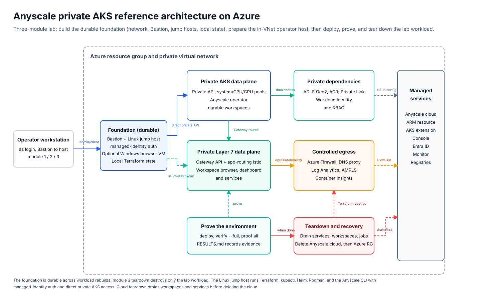
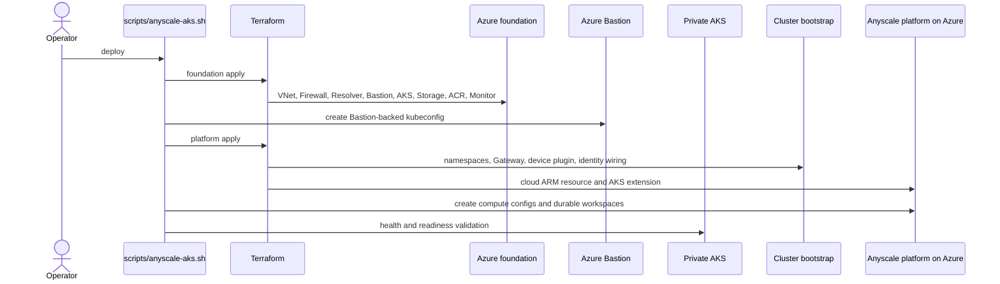
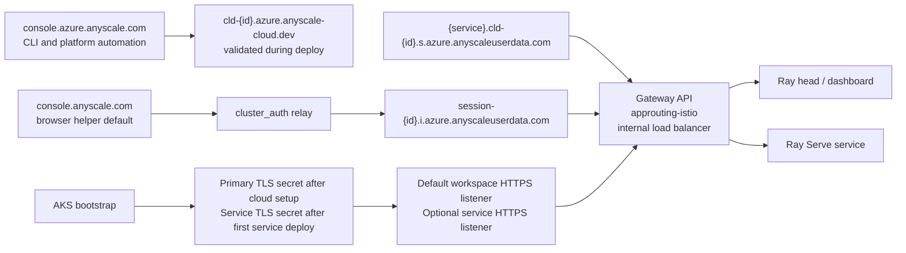
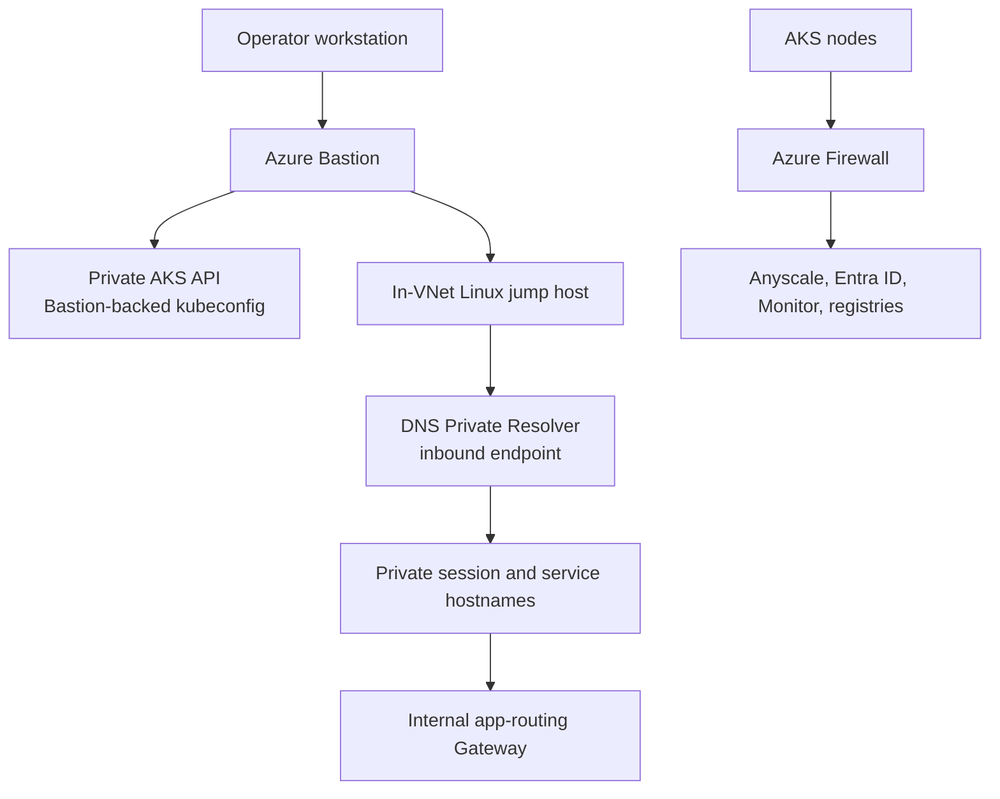

# Anyscale Private AKS Reference Architecture on Azure

> **Difficulty:** Advanced | **Roles:** Platform Engineer, Solution Architect | **Format:** Reference

This repository helps you build, prove, and tear down a private Anyscale on Azure environment on AKS. It creates the Azure network boundary, private AKS cluster, private storage and registry dependencies, Azure-native Anyscale platform resources, and the checks we use to prove the setup end to end.

The sample makes a few clear choices:

- AKS stays private.
- Workspace and service traffic stays on a private Layer 7 path inside the VNet.
- Storage and ACR stay private-only.
- Node egress is forced through Azure Firewall.
- Bastion is the primary administration path.
- A Linux automation jump host inside the VNet is the recommended way to operate the private cluster; an optional Windows browser jump host gives in-VNet browser access to private Anyscale URLs.

## Learning path

New here? Follow the hands-on lab. It walks you through operating Anyscale on a
private AKS cluster from a trusted in-VNet jump host, in five modules:

1. [Module 1: Foundation](docs/modules/module-1-foundation.md) — network
   boundary, Bastion, Linux automation jump host, and optional Windows browser
   jump host.
2. [Module 2: Jump hosts](docs/modules/module-2-jump-hosts.md) — bootstrap the
   Linux host into a repeatable, secret-free operator workstation.
3. [Module 3: Lab workload](docs/modules/module-3-lab-workload.md) — deploy,
   verify, and run the workload proofs.
4. [Module 4: Custom images](docs/modules/module-4-custom-image.md) — prove the
   custom-image requirement, build and push a custom Ray image to the private
   ACR, and prove the packaged dependency loads.
5. [Module 5: Image integrity](docs/modules/module-5-image-integrity.md) — sign
   the custom image with Notation and Key Vault, apply the Ratify verification
   config, and observe signed (compliant) versus unsigned (non-compliant)
   behavior in Azure Policy audit mode.

Start at [docs/modules/intro.md](docs/modules/intro.md). The lab ends with
[clean up](docs/modules/cleanup.md) as its final step. [Browser
access](docs/modules/browser-access.md) is a cross-cutting lesson you can use
from any module.

Run any module step by step, or run the whole lifecycle unattended:

```bash
./scripts/anyscale-aks.sh e2e --mode jump-host --custom-image --teardown
```

## Contents

- [Learning path](#learning-path)
- [Reference scope](#reference-scope)
- [Architecture](#architecture)
- [What this sample deploys](#what-this-sample-deploys)
- [Design principles](#design-principles)
- [Hostnames and trust boundaries](#hostnames-and-trust-boundaries)
- [Repository layout](#repository-layout)
- [Prerequisites](#prerequisites)
- [Quickstart](#quickstart)
- [Environment configuration](#environment-configuration)
- [Deployment workflow](#deployment-workflow)
- [Validation and workload proofs](#validation-and-workload-proofs)
- [Private access options](#private-access-options)
- [Gateway API, app-routing Istio, and TLS lifecycle](#gateway-api-app-routing-istio-and-tls-lifecycle)
- [Day-2 operations](#day-2-operations)
- [Teardown](#teardown)
- [Deleting the Anyscale cloud resource safely](#deleting-the-anyscale-cloud-resource-safely)
- [Validated baseline and caveats](#validated-baseline-and-caveats)
- [Related docs](#related-docs)

## Reference scope

This repository focuses on the AKS workload landing zone and the Anyscale on Azure integration points inside that landing zone. It assumes the target subscription and tenant already have the governance, policy, identity, and connectivity requirements your organization needs outside this sample.

## Architecture

The overview shows the full validated lifecycle: the private Azure foundation, private AKS data plane, Anyscale on Azure control-plane integration, workload proof path, and the drain-before-delete cleanup path.



The diagram is intentionally high level. The section-specific deep dives below zoom in on deployment sequencing, private Gateway traffic, and operator access paths.

### Deep dive: deployment and control flow

This diagram shows why deployment is split into two Terraform applies. The Azure foundation comes first, then the harness opens Bastion-backed private AKS access so Terraform can finish cluster bootstrap, install the Anyscale platform pieces, and run health checks from the private network path.



### Deep dive: private data plane, app-routing Istio, and TLS

This diagram shows the user traffic path, not public ingress. Browser and service hostnames stay on private `*.azure.anyscaleuserdata.com` names, route through the AKS-managed app-routing Istio Gateway, and terminate on Ray dashboard or Ray Serve targets inside AKS. Service TLS is created after a service exists; the optional service HTTPS listener is enabled only after that secret is present.



### Deep dive: Bastion and jump host access paths

This diagram shows the operator access path. Bastion is the default administration path for `kubectl`, Terraform, Helm, and validation. The in-VNet Linux jump host, reached through Bastion, gives routed access to private endpoints, private workspace or service hostnames, and the private ACR build/push path. AKS node egress stays controlled through Azure Firewall.



## What this sample deploys

| Layer | Components | Why it's here |
| --- | --- | --- |
| Networking | Private VNet, Azure Bastion, DNS Private Resolver, Azure Firewall, and private endpoints. | Isolates the AKS data plane and forces controlled, allow-listed egress. |
| AKS | Private AKS cluster with system, CPU, and GPU pools, OIDC issuer, Workload Identity, managed Gateway API installation, and app-routing Istio via `approuting-istio`. | Runs Ray workloads with no public API server and a private Layer 7 entry point. |
| Cluster bootstrap | Namespaces, operator service-account adoption metadata, workload identity wiring, the Anyscale Gateway chart, and the NVIDIA device plugin. | Prepares the cluster for the Anyscale operator and GPU scheduling. |
| Private dependencies | ADLS Gen2 with private endpoints, Premium ACR with Private Link, and Azure RBAC wiring for the operator identity. | Keeps storage and images private-only, reachable only from inside the VNet. |
| Anyscale platform | Azure-native Anyscale cloud ARM resource, AKS extension, built-in Anyscale Platform role assignments, `aks-cpu` and `aks-gpu` compute configs, and durable `aks-cpu-workspace` and `aks-gpu-workspace` workspaces. | Registers the Anyscale cloud on Azure and provisions reproducible workspaces. |
| Observability | Log Analytics, AMPLS, Container Insights, and Terraform-managed Azure diagnostics. | Provides private-link monitoring without public ingestion endpoints. |
| Validation | Static Terraform checks, live infrastructure validation, and deterministic CPU, GPU, build, train, and serve proofs. | Lets every architecture claim be re-tested with a known-good marker. |

## Design principles

- Treat this repository as a reference implementation for a private AKS data plane, not as a public ingress sample.
- Use Bastion-first access for `kubectl`, Terraform, Helm, and post-deploy operator tasks.
- Use the in-VNet Linux jump host for routed private endpoint access, including custom-image push to private ACR and private workspace or service hostnames.
- Keep Blob, DFS, and ACR private-only and test both in-cluster and submitter-machine access paths.
- Force node egress through Azure Firewall and maintain the documented allow-lists for Anyscale, Microsoft identity, Monitor, registries, and NVIDIA endpoints.
- Use AKS-managed Gateway API and app-routing Istio as the private Layer 7 entry point for browser, dashboard, and service traffic.
- Keep deterministic validation in the repo so each architecture claim can be tested again later.

## Hostnames and trust boundaries

| Surface | Default or pattern | Purpose |
| --- | --- | --- |
| `ANYSCALE_HOST` | `https://console.azure.anyscale.com` | CLI, AKS extension, teardown helpers, and platform automation. |
| `ANYSCALE_BROWSER_AUTH_HOST` | `https://console.anyscale.com` | Browser helper flows and `cluster_auth` relay entrypoint. |
| Anyscale cloud endpoint | `cld-{id}.azure.anyscale-cloud.dev` | Cloud endpoint validated during workspace registration before any CoreDNS aliasing logic is considered. |
| Workspace session host | `session-{id}.i.azure.anyscaleuserdata.com` | Private workspace and Ray dashboard browser path. |
| Service host | `{service}.cld-{id}.s.azure.anyscaleuserdata.com` | Private Anyscale service path. |

The validated baseline no longer depends on historical cloud-endpoint certificate issues as the primary architecture explanation. `scripts/anyscale-aks.sh deploy` now validates the Azure cloud endpoint certificate before workspace registration, and the current validated environment presented a matching certificate for `cld-*.azure.anyscale-cloud.dev`. The browser helper default remains `console.anyscale.com`, while CLI and platform automation remain pinned to `console.azure.anyscale.com`.

## Repository layout

| Path | Purpose |
| --- | --- |
| `infra/terraform/` | Terraform root for the lab RG, network, Bastion, jump hosts, firewall, DNS, AKS, Anyscale platform resources, outputs, and Terraform tests. |
| `scripts/anyscale-aks.sh` | Main entry point for deploy, verify, workload proofs, status, doctor, browser helpers, and teardown. |
| `scripts/setup.sh` | Compatibility entry point for existing automation while the script refactor lands. |
| `scripts/modules/` | Module-oriented wrappers for the user journey: foundation, jump hosts, lab workload, custom images, and image integrity. |
| `workloads/proofs/` | Deterministic CPU, GPU, build, train, serve, and custom-image dependency proof workloads. |
| `scripts/utility/` | Non-core utility implementations for local self-tests and workspace diagnostics. |
| `workloads/custom-image/` | Dockerfile and requirements for the custom Ray image built and pushed to the private ACR. |
| `workloads/image-integrity/` | Ratify trust policy and verifier manifests for the image-integrity audit demo. |
| `docs/modules/` | Hands-on module instructions for the guided end-to-end flow. |
| `docs/` | Architecture diagram, rendered preview, project summary, diagrams, results, and implementation notes. |

## Prerequisites

Before starting, make sure you have Azure access, a local operator workstation, and an Anyscale token.

- The central command, `./scripts/anyscale-aks.sh`, checks command-specific dependencies before deploy, proof, teardown, and full e2e runs. Missing tools fail early with install guidance.
- Required core tools: Git, Azure CLI `2.86.0` or newer, Terraform `>= 1.9.0`, `kubectl`, `kubelogin`, Helm, `jq`, `rsync`, Python `3.9+`, `uv`, `curl`, and `lsof`.
- The Anyscale CLI must be installed into the repo virtual environment at `.venv/bin/anyscale`.
- The Azure CLI `aks-preview` and `bastion` extensions are installed automatically when needed.
- Azure permissions must allow networking, Firewall, Bastion, AKS, Private Link, storage, ACR, Log Analytics, managed identities, RBAC assignments, and the Anyscale marketplace resources.
- GPU quota for `Standard_NC16as_T4_v3` in the target region.
- Sign in to the Anyscale CLI with `ANYSCALE_HOST=https://console.azure.anyscale.com .venv/bin/anyscale login`, or set `ANYSCALE_CLI_TOKEN` for non-interactive automation.

Run a readiness report with `./scripts/anyscale-aks.sh doctor`. The full dependency table and optional maintainer tools are in [docs/Developer-Workflows.md](docs/Developer-Workflows.md).

Install the repo-local Anyscale CLI before deploy:

```bash
uv venv .venv
UV_CACHE_DIR="$PWD/.cache/uv-cache" uv pip install --python .venv/bin/python anyscale
```

## Quickstart

New users should follow the module path in [docs/modules/intro.md](docs/modules/intro.md):
Module 1 builds the foundation, Module 2 prepares the jump host, Module 3
deploys and proves the lab workload, Module 4 demonstrates the custom-image
requirement, and Module 5 signs that image and proves image-integrity audit
behavior. The compatibility quickstart below is for
operators who already understand those boundaries.

```bash
cp .env-template .env
source .env
az login --tenant "$TF_VAR_azure_tenant_id"

uv venv .venv
source .venv/bin/activate
UV_CACHE_DIR="$PWD/.cache/uv-cache" uv pip install --python .venv/bin/python anyscale

./scripts/anyscale-aks.sh deploy
./scripts/anyscale-aks.sh verify --full
./scripts/anyscale-aks.sh proof all
```

`scripts/anyscale-aks.sh` renders `infra/terraform/terraform.auto.tfvars.json` from `.env`, uses local Anyscale CLI OAuth or `ANYSCALE_CLI_TOKEN` when provided, and manages the Bastion-backed kubeconfig needed for the private AKS bootstrap layer. `scripts/setup.sh` remains as a compatibility wrapper during the script refactor.

## Environment configuration

Start from a fresh clone and copy `.env-template` to `.env`.

```bash
cp .env-template .env
```

The most important inputs are:

| Setting group | What to set |
| --- | --- |
| `ARM_*` | Azure authentication and subscription context. The default path is `ARM_USE_CLI=true`. |
| `TF_VAR_project`, `TF_VAR_environment`, `TF_VAR_azure_location`, `TF_VAR_region_short` | Naming and region selection. |
| `TF_VAR_vnet_address_space`, `TF_VAR_subnet_cidrs` | Network ranges for the sample VNet and subnets. |
| Anyscale CLI auth | Run `ANYSCALE_HOST=https://console.azure.anyscale.com .venv/bin/anyscale login` for local OAuth, or set `ANYSCALE_CLI_TOKEN` for non-interactive automation. |
| `ANYSCALE_HOST` | Defaults to `https://console.azure.anyscale.com` for CLI and automation auth. |
| `ANYSCALE_BROWSER_AUTH_HOST` | Defaults to `https://console.anyscale.com` for browser helper flows and `cluster_auth`. |
| `TF_VAR_anyscale_fqdns`, `TF_VAR_azure_identity_fqdns`, `TF_VAR_azure_monitor_fqdns`, `TF_VAR_container_registry_fqdns` | Firewall allow-lists for Anyscale, identity, observability, and registries. |
| `TF_VAR_anyscale_platform_default_admin_assignment` | Defaults to assigning the current Terraform principal the built-in Anyscale Platform Administrator role at subscription scope for org-owner-style console access. |
| `TF_VAR_anyscale_platform_role_assignments` | Optional Azure RBAC assignments for additional Anyscale Platform Administrator, Contributor, or Reader principals at subscription, resource group, cloud, or custom scope. |
| `TF_VAR_anyscale_platform_admin_role_assignments` | Legacy cloud-scoped admin assignment map retained for compatibility. Prefer `TF_VAR_anyscale_platform_role_assignments`. |
| `TF_VAR_gpu_pool_configs` | GPU pool sizing. The default keeps one T4 node warm. |

## Deployment workflow

Use the orchestrator instead of raw Terraform commands and one-off shell steps. It builds the private Azure foundation, opens the Bastion-backed AKS path, installs the Anyscale platform pieces, and creates or reconciles the durable CPU and GPU workspaces.

```bash
./scripts/anyscale-aks.sh deploy
```

The deploy runs nine stages and finishes with a health summary (`<n>s` is the measured
stage duration):

```output
[setup] [9/9] health started
[setup] Azure AKS cluster aks-<project>-<env>-<region> is Succeeded/Running.
[setup] Anyscale AKS extension anyscale-operator provisioningState=Succeeded.
[setup] Anyscale cloud resource provisioningState=Succeeded.
[setup] Anyscale operator, app-routing Istio control plane, and Anyscale Gateway are Available.
[setup] CPU workspace aks-cpu-workspace API status=RUNNING.
[setup] GPU workspace aks-gpu-workspace API status=RUNNING.
[setup] [9/9] health ok (<n>s)
[setup] Deployment complete. Run ./scripts/anyscale-aks.sh verify --full, then ./scripts/anyscale-aks.sh proof all.
```

For a clean rebuild from scratch:

```bash
./scripts/anyscale-aks.sh deploy --from-scratch --yes
```

Every run writes local logs under `.cache/aks-anyscale-sample-harness/runs/<timestamp>-<command>/`, including `summary.md`, `stages.tsv`, and per-stage logs. The stage-by-stage breakdown is in [docs/Developer-Workflows.md](docs/Developer-Workflows.md).

## Validation and workload proofs

### Validation modes

```bash
./scripts/anyscale-aks.sh verify --static
./scripts/anyscale-aks.sh verify --live --skip-observability
./scripts/anyscale-aks.sh verify --full
```

| Command | What it checks |
| --- | --- |
| `verify --static` | `terraform fmt -check` and `terraform validate` on the rendered configuration. The plan-time Terraform contract tests (`tests/*.tftest.hcl`) run as a standalone gate via `terraform -chdir=infra/terraform test`. |
| `verify --live [--skip-observability]` | Azure resource state, Bastion-backed `kubectl`, operator rollout, workspace readiness, private DNS, Firewall-routed egress, Workload Identity storage access, submitter-machine private storage access, app-routing Gateway readiness and private reachability, Gateway TLS lifecycle, GPU scheduling, and observability when enabled. |
| `verify --full` | Runs both static and live validation. |

### Workload proofs

`deploy` registers the durable compute configs and workspaces:

- `aks-cpu`
- `aks-gpu`
- `aks-cpu-workspace`
- `aks-gpu-workspace`

Run the deterministic proofs with:

```bash
./scripts/anyscale-aks.sh proof cpu
./scripts/anyscale-aks.sh proof gpu
./scripts/anyscale-aks.sh proof pipeline
./scripts/anyscale-aks.sh proof all
```

Each proof prints a deterministic JSON payload followed by its success marker:

```output
{"marker": "CPU_RAY_PROOF_OK", "row_count": 16, "square_sum": 1240}
CPU_RAY_PROOF_OK
{"cube_sum": 784, "gpu_capacity": 1.0, "marker": "GPU_RAY_PROOF_OK", "row_count": 8}
GPU_RAY_PROOF_OK
CPU_BUILD_JOB_PROOF_OK
GPU_TRAIN_JOB_PROOF_OK
GPU_SERVE_SERVICE_PROOF_OK
```

| Command | Scope | Expected success markers |
| --- | --- | --- |
| `proof cpu` | Durable CPU workspace proof | `CPU_RAY_PROOF_OK` |
| `proof gpu` | Durable GPU workspace proof | `GPU_RAY_PROOF_OK` |
| `proof pipeline` | CPU build job, GPU train job, and GPU serve proof | `CPU_BUILD_JOB_PROOF_OK`, `GPU_TRAIN_JOB_PROOF_OK`, `GPU_SERVE_SERVICE_PROOF_OK` |
| `proof all` | Both durable workspace proofs plus the pipeline | All of the above |

The proof flow pushes the scripts in `workloads/proofs/`, runs them through the Anyscale CLI or the Kubernetes-backed fallbacks built into the harness, checks the expected markers, and writes diagnostics under `.cache/aks-anyscale-sample-harness/runs/<timestamp>-workload-*/`.

In the validated private AKS path, Anyscale job logs and service endpoint probes may need to run from inside the private workspace network. The harness detects successful jobs whose local submit stream missed a marker and retrieves logs from the workspace head pod; service probes retry from a service head pod inside AKS when direct workstation access to the private `*.s.azure.anyscaleuserdata.com` hostname times out.

The latest validated workload run was `.cache/aks-anyscale-sample-harness/runs/20260611T154800Z-workload-all`: prepare, CPU Ray, GPU Ray, CPU build, GPU train, and GPU Serve all passed. The Serve health check returned `GPU_SERVE_SERVICE_PROOF_OK` with model accuracy `1.0`; the service probe succeeded from inside AKS after direct workstation access to the private service URL failed.

### Full run results

The full e2e command writes a short local report to `RESULTS.md` at the repo root and overwrites any existing report:

```bash
./scripts/anyscale-aks.sh e2e --teardown
```

For the custom-image scenario, `e2e --custom-image` deploys and verifies through Bastion-backed AKS access, then builds and pushes the custom image from the in-VNet Linux jump host where the private ACR endpoints resolve. It runs `prove-failure`, `preflight`, `prepare`, `apply`, and `proof`; it does not sign or verify the image. Resume with `custom-image prepare`, `custom-image apply`, `custom-image proof`, and `proof all`. Sign and verify the image with the explicit `module 4 sign` and `module 4 verify` steps — both are required before Module 5 image-integrity verification.

The report is intentionally not tracked by Git. It records whether build-up, full verification, all workload proofs, and teardown passed, plus the latest run-summary paths.

## Private access options

### Bastion-backed administration

Bastion is the primary access path for the private cluster.

- `scripts/anyscale-aks.sh` creates and reuses a Bastion-backed kubeconfig for Terraform bootstrap, `kubectl`, Helm, live validation, and workload proof commands.
- Use Bastion first for cluster administration, health checks, and post-deploy troubleshooting.
- Keep Bastion available until Kubernetes resources managed through the Bastion-backed kubeconfig are torn down.

### Browser helper flows

If you want local browser testing without changing your system network, the repo also includes isolated helper flows:

```bash
./scripts/anyscale-aks.sh browser open --session-id ses_xxx
./scripts/anyscale-aks.sh head open --session-id ses_xxx
```

- `workspace-browser-open` starts or reuses the Bastion tunnel, discovers the private Gateway service, port-forwards ports 80 and 443 locally, launches a temporary Firefox profile, and opens the `cluster_auth` flow for the target private session host.
- `workspace-head-open` starts the direct Ray Dashboard head-service port-forward plus the Gateway tunnel and launches a temporary Firefox profile directly against the local dashboard fallback.

Stop them with:

```bash
./scripts/anyscale-aks.sh browser stop
./scripts/anyscale-aks.sh head stop
```

## Gateway API, app-routing Istio, and TLS lifecycle

This sample treats AKS-managed Gateway API and app-routing Istio as the target private Layer 7 path.

- `scripts/anyscale-aks.sh` requires Azure CLI `2.86.0` or newer, then verifies the app-routing Gateway API prerequisites before Terraform enables `properties.ingressProfile.gatewayAPI.installation = "Standard"`.
- The Terraform-managed bootstrap layer deploys the Anyscale Gateway chart with `gatewayClassName: approuting-istio`, internal load balancer annotations, and a stable private load balancer IP.
- The Anyscale AKS extension is configured with `networking.gateway.*` settings so the operator emits Gateway API `HTTPRoute` resources instead of relying on legacy `Ingress` resources.
- The primary TLS secret `anyscale-<cloud-deployment-id-with-hyphens>-certificate` is expected after the Azure-native cloud and operator setup completes.
- The service TLS secret `anyscale-svc-<cloud-deployment-id-with-hyphens>-certificate` appears after an Anyscale service is deployed; enable `cluster_bootstrap.gateway_service_https_enabled` after that secret exists to add the service HTTPS listener.
- The Gateway has an HTTPS listener for `*.i.azure.anyscaleuserdata.com` by default and can add the `*.s.azure.anyscaleuserdata.com` service listener, matching the Anyscale on Azure Gateway API guidance while using AKS app-routing Istio as the managed Gateway implementation.
- The latest validated Gateway kept the default `http` and `https` listeners and reported `Accepted=True`, `Programmed=True`, and `ResolvedRefs=True`; the service TLS secret appeared after the Serve proof, but the optional `https-service` listener was not enabled for that run.
- `verify --live` reports Gateway reachability, listener conditions, primary certificate state, and service-certificate pending or present state.

## Day-2 operations

For normal operation, use the same proof-first loop from the quickstart: `deploy`, `verify --full`, `proof all`, then `teardown` when you are done. Useful status commands are:

```bash
./scripts/anyscale-aks.sh status
./scripts/anyscale-aks.sh doctor
```

Maintainer-focused workflows for dependency details, custom Ray images, run artifacts, optional AKS tooling, diagram export, and idempotency self-tests are in [docs/Developer-Workflows.md](docs/Developer-Workflows.md). For image signing and the Ratify + Azure Policy audit demo, see [Module 5: Image integrity](docs/modules/module-5-image-integrity.md).

## Teardown

Use the normal path when you want Terraform-backed cleanup:

```bash
./scripts/anyscale-aks.sh teardown
```

That path drains the Anyscale cloud first, stops Bastion if needed, runs `terraform destroy`, and clears the cached cloud deployment ID from `.env`.

For the module path, use [docs/modules/cleanup.md](docs/modules/cleanup.md): run
`./scripts/anyscale-aks.sh module 3 teardown` to tear down the whole lab. That
command runs the full single-root `terraform destroy`, so there is no separate
foundation layer left to remove afterward.

Use the stronger reset path when you need Azure CLI to delete the resource group directly and clear local state:

```bash
./scripts/anyscale-aks.sh teardown --force --yes
```

That flow first drains the Anyscale cloud, then deletes the shared lab resource
group, waits for the delete to finish, and removes local Terraform state and
saved plans for the Terraform root. It keeps `.env` and `.terraform.lock.hcl`.

## Deleting the Anyscale Cloud Resource Safely

The Anyscale cloud ARM resource is not just another Azure object. It represents a live Anyscale cloud in the hosted Anyscale control plane, and that cloud can still have workspaces, jobs, services, and backing Ray sessions attached to it.

Before deleting the Anyscale cloud resource, the harness drains the Anyscale side first:

1. It maps the Azure cloud ARM resource name to the Anyscale cloud ID.
2. It lists the current cloud's services, jobs, and workspaces, including archived resources where the CLI supports it.
3. It asks Anyscale to terminate services in that cloud.
4. It asks Anyscale to terminate workspaces in that cloud.
5. If a workspace still has a backing Ray session or cluster ID, it also sends a direct cluster terminate request.
6. It waits until jobs, services, and workspaces reach terminal states before Azure deletion continues.
7. It deletes the nested Azure cloud resource child, `cloudResources/default`, before deleting the parent Anyscale cloud ARM resource.

We do this for two reasons:

- It gives Anyscale a chance to shut down workspaces, services, jobs, and Ray sessions cleanly before Azure removes the infrastructure underneath them.
- It avoids Azure delete blockers where the parent Anyscale cloud resource cannot be removed while nested cloud resources still exist.

If the Anyscale cloud resource is already gone, the force teardown path skips the cloud drain and continues with Azure resource-group deletion. That makes recovery safe to rerun after a partial teardown.

## Validated baseline and caveats

The current validated baseline targets Kubernetes `1.34.6` in `westus3`.

Known non-blocking caveats:

- The operator pod can still emit recurring `502 Bad Gateway` warnings from the `vector` sidecar telemetry sinks on `http://localhost:3100` and `http://localhost:3101/api/v1/push`.
- The custom GPU instance type still needs the legacy resource key `'accelerator_type:T4': 1` alongside `accelerators: [T4]` for the current admission path.
- `anyscale job submit --working-dir` still uploads through the submitter machine first, so private Blob and DFS access from the submitter must be validated separately from in-cluster Workload Identity.
- Normal Terraform teardown can still fail late if the Kubernetes provider loses Bastion-backed API access while deleting Kubernetes resources. The force teardown path is the supported recovery path and was validated in the latest run.

## Related docs

- `README.md` is the main operator guide.
- [docs/modules/intro.md](docs/modules/intro.md) is the hands-on lab landing page; the five module docs ([Module 1](docs/modules/module-1-foundation.md), [Module 2](docs/modules/module-2-jump-hosts.md), [Module 3](docs/modules/module-3-lab-workload.md), [Module 4](docs/modules/module-4-custom-image.md), [Module 5](docs/modules/module-5-image-integrity.md)) plus [browser access](docs/modules/browser-access.md) and [clean up](docs/modules/cleanup.md) are the recommended learning path.
- [docs/project-summary.md](docs/project-summary.md) is the maintainer-oriented summary of repository structure, architecture, operating contracts, and contribution rules.
- [docs/Implementation-Notes.md](docs/Implementation-Notes.md) keeps validated implementation facts and the Anyscale on Azure public-preview knowledge base used for this implementation.
- [docs/Developer-Workflows.md](docs/Developer-Workflows.md) is the maintainer appendix: dependency, artifact, diagram export, custom image, tooling, idempotency, and agent-skill provenance notes. It is not part of the primary lab flow.
