# Architecture

This page is the architecture landing view for the Anyscale private AKS
reference architecture on Azure. It starts with a simplified whole-solution
diagram, summarizes the security features and their purpose, and then links the
two detailed views: the AKS components and networking view and the Anyscale
platform components view.

## Whole-solution overview

The overview is intentionally simplified. It shows operator access, the private
AKS data plane, private Azure dependencies, controlled egress, and the managed
external services outside the virtual network. The optional Anyscale Private
Link path is drawn dashed.

Canonical editable source: [diagrams/01-architecture-overview.mmd](diagrams/01-architecture-overview.mmd).
Alternate editable source: [diagrams/01-architecture-overview.drawio](diagrams/01-architecture-overview.drawio).

## Security features

| Feature | Purpose |
| --- | --- |
| Private AKS API with API server VNet integration | Keeps the Kubernetes API server off the public internet and reachable only from within the virtual network through a delegated subnet. |
| Azure Bastion with no VM public IPs | Gives operators brokered RDP/SSH access to in-VNet jump hosts without assigning any public IP to a virtual machine. |
| Azure Firewall with UDR, explicit egress allowlists, and DNS proxy | Forces node and jump-host egress through a single controlled hop, allows only named destinations, and resolves those destinations through the firewall DNS proxy. |
| Private endpoints, private DNS, and DNS Private Resolver | Provides private connectivity and name resolution for ADLS Gen2 (blob and dfs), ACR, Key Vault, and AMPLS so these data-plane paths stay on the Azure backbone. |
| Azure CNI with Azure network policy and NSGs | Assigns routable pod networking and enforces subnet- and pod-level traffic rules inside the cluster. |
| Entra-backed Kubernetes RBAC with local accounts disabled by default | Authenticates cluster access through Microsoft Entra ID and removes static local admin credentials. |
| OIDC Workload Identity and managed identities | Lets workloads and the Anyscale operator obtain federated tokens so no cloud credentials are stored in the cluster. |
| Private ACR with AcrPull; private, Entra ID-only ADLS Gen2 | Restricts image pulls to the kubelet identity over a private endpoint and keeps object storage reachable only through Entra ID and private networking. |
| Internal Gateway API with app-routing Istio and TLS | Terminates workspace and service traffic on an internal load balancer with TLS, without any public workload ingress. |
| Defender for Containers, Azure Policy, and Key Vault Secrets Provider | Adds runtime threat detection, policy guardrails, and CSI-mounted secrets sourced from Key Vault. |
| Container Insights with AMPLS | Collects cluster telemetry and keeps the monitoring ingestion path private through an Azure Monitor Private Link Scope. |
| Image Integrity Preview with Ratify, Notation, and Azure Policy in AUDIT ONLY mode | Reports unsigned images as non-compliant for visibility. Unsigned images are not blocked, and per Microsoft Learn this preview is not intended for production registries or workloads. |
| Optional cross-tenant Anyscale control-plane Private Link with manual approval | Lets the cloud-specific control-plane domain be reached over a manually approved private endpoint instead of firewall egress, while other required egress remains. |

Key Vault posture is precise: the vault uses a private endpoint with a
default-deny public network posture rather than a guarantee that no Key Vault
traffic can ever be public.

## AKS components and networking

This detailed view separates three trust zones: the Public Internet (outbound
only), managed external services outside the customer virtual network, and
the customer private virtual network with its subnets. External systems are
drawn as terminator shapes.

Canonical editable source: [diagrams/06-aks-networking.mmd](diagrams/06-aks-networking.mmd).
Alternate editable source: [diagrams/06-aks-networking.drawio](diagrams/06-aks-networking.drawio).

Legend: solid edges are required or default paths; dashed edges are optional
paths or private name resolution; terminator (stadium) shapes are external
systems. Node and jump-host egress follows user-defined routes to Azure
Firewall, which permits only named endpoints. The delegated API-server subnet
integrates with the managed control plane, and the private-endpoint subnet
carries data traffic to ADLS Gen2, ACR, Key Vault, and AMPLS. No workload has a
public ingress.

## Anyscale platform components

This detailed view shows the Anyscale managed control plane, the Azure ARM
integration that registers the cloud and installs the operator, the in-cluster
Anyscale runtime, and the private Azure dependencies.

Canonical editable source: [diagrams/07-anyscale-components.mmd](diagrams/07-anyscale-components.mmd).
Alternate editable source: [diagrams/07-anyscale-components.drawio](diagrams/07-anyscale-components.drawio).

Legend: solid edges are required or default paths; dashed edges are the optional
Private Link path; terminator shapes are external systems. The default
control-plane route is in-cluster operator and workloads to Azure Firewall to the
cloud-specific control-plane endpoint. The optional route runs through private
DNS to a cross-tenant, manually approved private endpoint that reaches the
Anyscale Private Link Service. `console.azure.anyscale.com` stays public for
local CLI, OAuth, and teardown; Private Link covers the cloud-specific
control-plane domain only, and Entra, ARM, and registry egress remain required.
