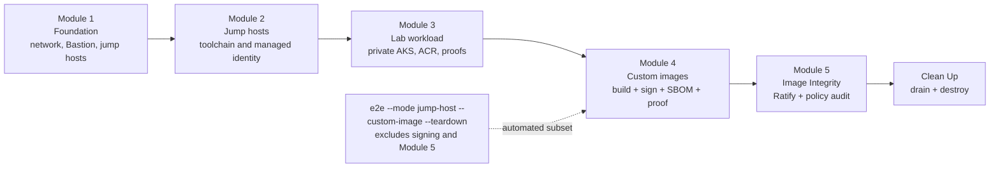

# Anyscale on Private AKS Lab

This lab deploys and validates Anyscale on a private Azure Kubernetes Service
(AKS) cluster. Commands use `./scripts/anyscale-aks.sh`; deployment inputs come
from the repository-root `.env` file.

The lessons assume Azure 200-level knowledge: you can select a subscription,
use Azure CLI, read a Terraform plan, and recognize common networking, identity,
and RBAC concepts. Deep AKS, Kubernetes, or Anyscale experience is not required.
Each module identifies where to run a command and provides a checkpoint before
you continue.

## Module Map

| Module | Scope | Depends on | Required |
| --- | --- | --- | --- |
| [1. Foundation](module-1-foundation.md) | VNet, firewall, DNS, Bastion, Linux jump host, and optional Windows browser jump host. | None | Yes |
| [2. Jump Hosts](module-2-jump-hosts.md) | Linux jump-host toolchain, managed-identity access, and optional Windows browser jump-host verification. | Module 1 | Yes |
| [3. Lab Workload](module-3-lab-workload.md) | Private AKS, private ACR, Anyscale platform, workspaces, and workload proofs. | Modules 1 and 2 | Yes |
| [4. Custom Images](module-4-custom-image.md) | Private ACR image build, dependency proof, signature, and SBOM. | Modules 1 through 3 | Optional; required for Module 5 |
| [5. Image Integrity](module-5-image-integrity.md) | Ratify and Azure Policy audit of signed and unsigned images. | Modules 1 through 4 | Optional |

Use [Browser Access](browser-access.md) when an operator needs a browser inside
the VNet. Finish with [Clean Up](cleanup.md) to drain Anyscale resources and
destroy the Azure resources.

The five modules build on each other. The `e2e` shortcut automates deployment,
verification, custom-image build/SBOM/proof, workload proofs, and optional
teardown. Image signing and Module 5 remain explicit guided steps:



## Access Model

The workload AKS cluster is private. Its API server, storage, and container
registry have no public endpoints. Rather than punch routed connectivity from
every operator workstation into the VNet, the deployment provides a **Linux
jump host** inside the VNet. Private operations such as `kubectl`, Helm, Podman,
and Anyscale CLI submissions run there. Terraform runs only on the operator
workstation. The Linux jump host authenticates to Azure with a managed identity.

The optional **Windows 11 browser jump host** solves a different problem:
console-launched Anyscale URLs redirect to private `*.azure.anyscaleuserdata.com`
hostnames. A browser running *inside* the VNet resolves and reaches them
natively. See [browser-access.md](browser-access.md).

## Run Modes

Run the lab by module or as one lifecycle:

- **By module:** run each `module N <stage>` command from its module page.
- **Automated subset:** run deployment, verification, selected custom-image
  stages, workload proofs, and teardown in one command:

  ```bash
  ./scripts/anyscale-aks.sh e2e --mode jump-host --custom-image --teardown
  ```

> **Warning:** Do not use the unattended `e2e` path for a first run. Work
> through the modules interactively so every checkpoint stays visible. The
> `--teardown` flag destroys the lab at the end of the run.

## Execution Modes

The harness behaves differently depending on `ANYSCALE_EXECUTION_MODE`:

- `workstation` is the default. The harness uses Azure CLI authentication and a
  Bastion-backed kubeconfig to reach the private AKS API.
- `jump-host` runs private post-configuration and proof operations on the Linux
  jump host with managed-identity authentication and direct VNet access.

Terraform remains on the operator workstation in both modes. Module 2 writes
`ANYSCALE_EXECUTION_MODE=jump-host` to the synced jump-host `.env`; `e2e --mode
jump-host` selects the same path for the full lifecycle.

## Prerequisites

> **Warning:** This lab creates billable Azure resources, including Azure
> Firewall, Bastion, AKS, virtual machines, storage, ACR, Key Vault, and Log
> Analytics. Use a dedicated test subscription and run [Clean Up](cleanup.md)
> when you finish.

- A dedicated Azure test subscription, or permission to create a dedicated
  resource group in one.
- `Owner` on the target subscription, or an approved combination of roles that
  can create the listed resources, role assignments, marketplace resources, and
  Azure Policy assignments. For least privilege, have your Azure administrator
  review the plan before granting access.
- Required Azure resource providers registered in the target subscription,
  including `Microsoft.ContainerService`, `Microsoft.Compute`,
  `Microsoft.Network`, `Microsoft.Storage`, `Microsoft.ManagedIdentity`,
  `Microsoft.Authorization`, and `Microsoft.MarketplaceOrdering`.
- Quota and regional availability for the VM sizes in `.env-template`. The
  default GPU pool uses `Standard_NC16as_T4_v3`; Module 3 explains how to omit
  the GPU path.
- Azure CLI authenticated on the operator workstation with `az login`, with the
  intended subscription selected by `az account set --subscription <name-or-id>`.
- An Anyscale on Azure account that can sign in at
  `https://console.azure.anyscale.com`. If your organization does not have
  access, contact its Anyscale administrator or Anyscale before starting.
- A repository-root `.env` copied from `.env-template` and populated with every
  required `TF_VAR_*` input.
- The local tools checked by `./scripts/anyscale-aks.sh doctor`. Module 2
  installs the private-operation toolchain on the Linux jump host.

> **Note:** The first deployment may require acceptance of the Anyscale AKS
> Operator Azure Marketplace terms in the target subscription. The harness
> reports this before it changes resources. Use an identity authorized to accept
> the terms, or have a subscription administrator accept them.

Before Module 1, run this non-deploying readiness check from the repository root
on the workstation:

```bash
./scripts/anyscale-aks.sh doctor
```

Resolve missing required workstation tools, `.env`, Azure authentication, and
Anyscale authentication before continuing.

> **Note:** Some `doctor` findings are expected this early. Before the first
> Terraform plan it reports that Terraform is not initialized, and Module 1
> initializes it. Podman and the image-signing tools matter only in Modules 4
> and 5. VM availability and quota are checked in Modules 1 and 3.

## Start

Start with [Module 1: Build the Foundation](module-1-foundation.md).
