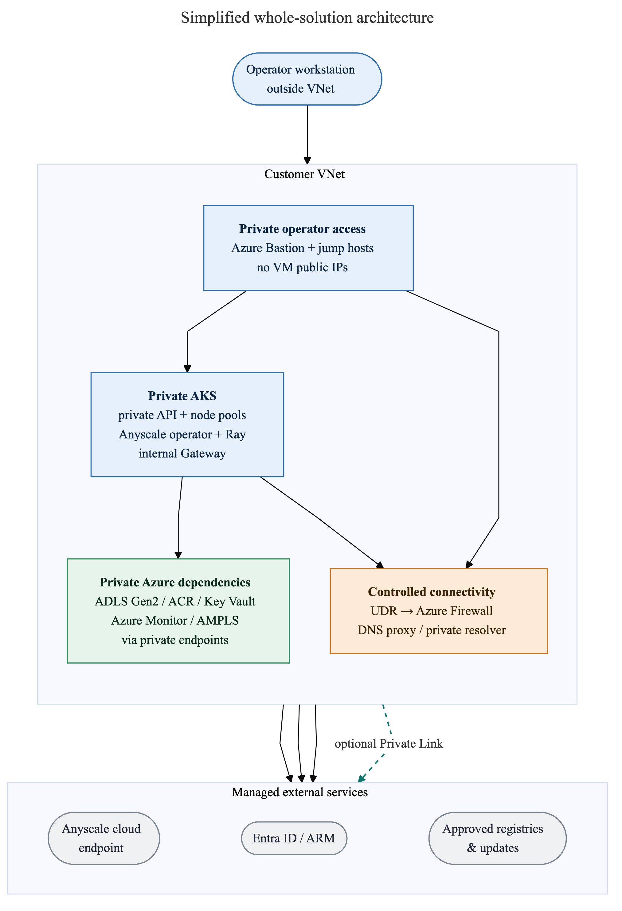
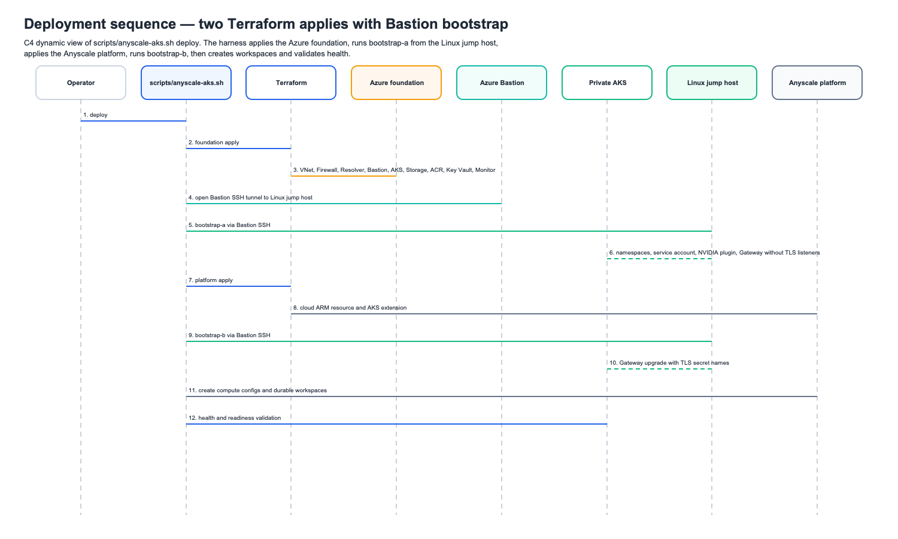

# Project Summary

This repository deploys and validates an Anyscale platform private data plane
on Azure Kubernetes Service. Terraform owns the Azure foundation and platform
integration; the bash harness owns staged deployment, private access,
validation, proofs, and teardown.

Operator instructions start in the [README](../README.md). Maintainer setup and
commands are in [Maintainer Workflows](maintainer-workflows.md).

## Current Architecture

The [architecture landing page](architecture.md) collects the high-level view, a
security feature and purpose table, and two detailed views: the AKS components
and networking view and the Anyscale platform components view.

- A private AKS cluster runs system, CPU, and GPU pools, the Anyscale operator,
  durable workspaces, jobs, and services.
- Private ADLS Gen2, ACR, Key Vault, and Azure Monitor endpoints support the
  cluster without public data-plane access.
- Azure Firewall and UDRs control firewall egress from AKS and the jump-host
  subnets. Azure DNS Private Resolver and private zones provide name resolution.
- Azure Bastion connects the workstation to the private AKS API and both jump
  hosts. The Linux jump host runs private operational workflows; the optional
  Windows browser jump host reaches private web endpoints.
- AKS Application Routing Gateway API with `approuting-istio` and an internal
  load balancer routes workspace and service traffic.
- The Anyscale platform cloud and cloud resource are Azure ARM resources. The
  AKS marketplace extension connects the operator to the control plane with
  Workload Identity.
- Optional Anyscale control-plane Private Link replaces matching firewall
  egress with a manual cross-tenant private endpoint and private DNS.

## Code Ownership

| Area | Owner |
| --- | --- |
| Root deployment graph, inputs, outputs, and tests | `infra/terraform/` |
| Azure network, DNS, firewall, routing, Bastion, and jump hosts | `infra/terraform/modules/network`, `dns`, `dns_resolver`, `firewall`, `routing`, `bastion`, `jump_host`, `browser_jump_host` |
| AKS, node pools, OIDC, Workload Identity, and Gateway API enablement | `infra/terraform/modules/aks` |
| Storage, ACR, Key Vault, identities, observability, and image integrity | Corresponding modules under `infra/terraform/modules/` |
| Anyscale platform ARM resources, extension, RBAC, and lifecycle | `infra/terraform/anyscale.tf` and the platform ARM template |
| Kubernetes bootstrap and Gateway resources | `infra/terraform/modules/cluster_bootstrap`, `scripts/bootstrap-k8s.sh` |
| Public command dispatcher | `scripts/anyscale-aks.sh` |
| Deployment, validation, proof, image, and browser implementation | `scripts/setup.sh` |
| Module entry points | `scripts/modules/` |
| Teardown, submission, logging, and timeout libraries | `scripts/lib/` |
| Deterministic proof payloads | `workloads/proofs/` |
| Custom image and integrity assets | `workloads/custom-image/`, `workloads/image-integrity/` |

## Deployment and Access Flow

1. The workstation loads `.env`, exports the complete `TF_VAR_*` contract, and
   applies the private Azure foundation.
2. The harness establishes Bastion-backed AKS access and applies the first
   Kubernetes bootstrap phase.
3. Terraform applies the Anyscale platform resources, marketplace extension,
  and platform RBAC.
4. The Linux jump host runs the second bootstrap phase to reconcile the
  internal Gateway and TLS resources.
5. The harness creates CPU/GPU compute configurations and durable workspaces,
   then runs health checks.
6. Ray proofs use the Bastion-backed kubeconfig. Upload-based job, service, and
   custom-image proofs run on the Linux jump host with private storage DNS.
7. Teardown drains Anyscale runtime objects and cloud resources before deleting
   the extension, AKS, Bastion, and the Azure foundation.

The workstation is the only Terraform execution location. The Linux jump host
owns in-VNet post-configuration, custom image build/push, and proof submission.
The Windows browser jump host owns private browser access.

## Repository Contracts

- `.env` is ignored and supplies every root Terraform variable through
  `TF_VAR_*`; root variables have no defaults.
- Resource names are centralized in `infra/terraform/locals.tf`.
- Terraform requires `>= 1.9.0`; providers use AzureRM `~> 5.2` and AzAPI
  `~> 2.12`.
- AKS, storage, ACR, Key Vault, and the private data plane stay private.
- Firewall egress remains allow-listed. An empty
  `anyscale_jump_host_fqdns` falls back to `anyscale_fqdns`.
- Canonical Windows output names use the `browser_jump_host_*` prefix.
- Cached Azure CLI and Anyscale OAuth credentials are the normal local auth
  path. Tokens and keys are never committed or printed.
- Local run evidence stays under `.cache/`; the root `RESULTS.md` is generated.
- Destructive deploy/reset/teardown operations require explicit authorization.

Detailed configuration and modification points are in
[Configuration Reference](configuration-reference.md). Proof marker names and
evidence interpretation are in [Proof Markers](proof-markers.md).

## Extension Ownership

| Extension surface | Required ownership pattern |
| --- | --- |
| New Terraform capability | Add or update the owning root/module contract and its Terraform test. |
| New harness command | Route it through `scripts/anyscale-aks.sh` and implement it in the existing module, setup, or library owner. |
| New proof | Add a deterministic payload under `workloads/proofs/`, emit a stable proof marker, wire the dispatcher, and update `docs/proof-markers.md`. |
| Firewall destination | Add it to the narrowest `TF_VAR_*_fqdns` list and preserve private routing. |
| Node pool or compute shape | Update the AKS module input and matching compute profile in `scripts/setup.sh`. |
| Gateway or TLS behavior | Keep the AKS profile, bootstrap resources, extension settings, DNS, and health checks aligned. |
| Custom image dependency | Update `workloads/custom-image/`, build on the Linux jump host, and validate the image/SBOM/signature flow. |
| Image integrity policy | Update the `image_integrity` module and `workloads/image-integrity/` manifests together. |
| Maintainer workflow | Update [Maintainer Workflows](maintainer-workflows.md) without duplicating the command implementation. |

## Entry Points

- [README](../README.md): operator workflow.
- [Guided modules](modules/intro.md): hands-on sequence.
- [Maintainer Workflows](maintainer-workflows.md): setup, checks, deploy stages,
  proofs, images, diagrams, and generated artifacts.
- [Configuration Reference](configuration-reference.md): current configuration
  contract and modification points.
- [Proof Markers](proof-markers.md): stable proof marker and evidence reference.
